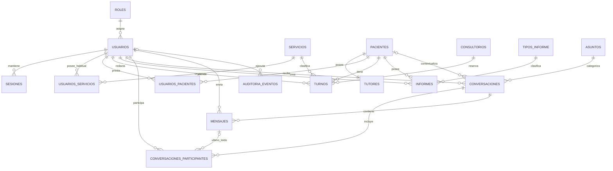

# Centro Educativo Interdisciplinario Terapéutico
## Modelo de datos y reglas de persistencia — MVP

**Versión documental:** 4.0
**Fecha:** 1 de agosto de 2026
**Motor:** PostgreSQL 16+
**ORM:** Sequelize 6
**Estado:** baseline normativo para implementación

---

## 1. Propósito y alcance

Este documento define el modelo lógico y las reglas de persistencia del MVP:

- entidades, campos y nulabilidad;
- relaciones y cardinalidades;
- claves primarias y foráneas;
- restricciones `UNIQUE`, `CHECK` y de exclusión;
- índices asociados con consultas reales;
- reglas históricas y de baja lógica;
- operaciones transaccionales;
- protección frente a concurrencia;
- orden de migraciones y seeders;
- pruebas mínimas de integridad.

Debe leerse junto con:

- `docs/contrato-api.md`, para entradas, salidas y errores HTTP;
- `docs/matriz-permisos.md`, para roles, alcance por fila y campos visibles;
- `docs/arquitectura-backend.md`, para capas, transacciones y criterios técnicos;
- `api/AGENTS.md` y los `AGENTS.md` especializados, para instrucciones operativas.

Las migraciones son la fuente de verdad del esquema físico. Los modelos Sequelize deben reflejarlas, pero no pueden sustituirlas ni crear el esquema mediante `sequelize.sync()`.

Este documento consolida y reemplaza las reglas incompatibles de la versión 3.0, en particular:

1. `usuarios_servicios` representa servicios habituales; no autoriza ni limita turnos.
2. Un turno puede utilizar cualquier servicio activo.
3. `SERVICIO_NO_ASIGNADO` no pertenece al dominio Turnos.
4. Los servicios incorporan imagen, visibilidad pública y orden público.
5. `activo` y `visible_publicamente` son atributos independientes.
6. No existen reprogramación ni edición estructural de turnos.
7. El estado de lectura y el archivo de conversaciones son individuales por participante.

### 1.1 Precedencia documental

Aplicar el siguiente orden:

1. requerimientos funcionales y decisiones expresamente aprobadas;
2. `docs/contrato-api.md`;
3. `docs/matriz-permisos.md`;
4. este documento;
5. `docs/arquitectura-backend.md`;
6. los `AGENTS.md` aplicables.

Si dos fuentes normativas se contradicen, detener la implementación afectada. No elegir una interpretación por conveniencia ni modificar una migración para ocultar la contradicción.

---

## 2. Convenciones de PostgreSQL

### 2.1 Nombres y claves

- tablas y columnas en `snake_case`;
- tablas en plural;
- claves foráneas con sufijo `_id`;
- identificadores públicos y claves primarias de tipo `UUID`;
- estados como `VARCHAR` con `CHECK`, no como enum nativo;
- timestamps estándar `created_at` y `updated_at` cuando corresponda.

Todas las tablas usan, salvo indicación expresa:

```sql
id UUID PRIMARY KEY DEFAULT gen_random_uuid()
```

### 2.2 Fechas y zona horaria

- `TIMESTAMPTZ` para instantes reales: sesiones, turnos, mensajes, auditoría y transiciones;
- `DATE` para fechas civiles: nacimiento y vencimiento de CUD;
- instantes persistidos en UTC;
- agenda interpretada en `America/Argentina/Cordoba`;
- intervalos temporales con semántica `[inicio, fin)`.

No utilizar el huso horario del servidor como regla de negocio.

### 2.3 Timestamps

- `created_at TIMESTAMPTZ NOT NULL DEFAULT now()`;
- `updated_at TIMESTAMPTZ NOT NULL DEFAULT now()` en entidades editables;
- `mensajes` y `auditoria_eventos` no necesitan `updated_at` porque son inmutables para la aplicación;
- Sequelize debe mapear nombres con `underscored: true`.

### 2.4 Eliminación e historia

La operación normal no elimina físicamente:

- usuarios;
- pacientes y tutores;
- turnos;
- informes;
- conversaciones y mensajes;
- auditoría;
- catálogos utilizados.

Se emplean:

- `activo = false` para usuarios, pacientes y catálogos;
- estados terminales para turnos;
- períodos con fecha de fin para vínculos;
- inmutabilidad para informes finalizados y mensajes;
- archivo individual para conversaciones.

Las políticas `ON DELETE` son defensas técnicas y soporte para pruebas; no habilitan borrado físico desde la API.

### 2.5 Extensiones obligatorias

```sql
CREATE EXTENSION IF NOT EXISTS pgcrypto;
CREATE EXTENSION IF NOT EXISTS btree_gist;
```

`pgcrypto` genera UUID. `btree_gist` permite combinar igualdad sobre UUID con solapamiento de rangos en los constraints de Turnos.

---

## 3. Catálogo de tablas

El MVP contiene exactamente 17 tablas:

1. `roles`
2. `usuarios`
3. `sesiones`
4. `servicios`
5. `usuarios_servicios`
6. `pacientes`
7. `tutores`
8. `usuarios_pacientes`
9. `consultorios`
10. `turnos`
11. `tipos_informe`
12. `informes`
13. `asuntos`
14. `conversaciones`
15. `conversaciones_participantes`
16. `mensajes`
17. `auditoria_eventos`

No agregar tablas para dashboard, notificaciones, recuperación de contraseña, múltiples tutores, recurrencias, disponibilidad personalizada, archivos adjuntos ni contactos públicos durante el MVP.

---

## 4. `roles`

Catálogo fijo de roles de acceso.

| Campo | Tipo | Nulo | Regla |
|---|---|:---:|---|
| `id` | UUID | No | PK. |
| `codigo` | VARCHAR(30) | No | Único e inmutable. |
| `nombre` | VARCHAR(80) | No | Nombre visible. |
| `descripcion` | VARCHAR(255) | Sí | Explicación funcional. |
| `created_at` | TIMESTAMPTZ | No | Default `now()`. |
| `updated_at` | TIMESTAMPTZ | No | Default `now()`. |

Valores base:

```text
administrador
coordinacion
secretaria
profesional
```

Reglas:

- cada usuario tiene exactamente un rol;
- no existe CRUD de roles;
- `codigo` se utiliza en policies y tokens;
- los roles no se eliminan ni desactivan en el MVP.

---

## 5. `usuarios`

Única entidad para las personas que acceden al panel privado.

| Campo | Tipo | Nulo | Regla |
|---|---|:---:|---|
| `id` | UUID | No | PK. |
| `rol_id` | UUID | No | FK a `roles`. |
| `nombre` | VARCHAR(100) | No | Texto normalizado. |
| `apellido` | VARCHAR(100) | No | Texto normalizado. |
| `dni` | VARCHAR(20) | No | Dígitos, único. |
| `email` | VARCHAR(254) | No | Único sin distinguir mayúsculas. |
| `password_hash` | VARCHAR(255) | No | Hash bcrypt del DNI normalizado. |
| `titulo` | VARCHAR(120) | Sí | Título profesional o tratamiento. |
| `especialidad` | VARCHAR(150) | Sí | Obligatoria por negocio para rol `profesional`. |
| `telefono` | VARCHAR(40) | Sí | Uso interno. |
| `bio` | TEXT | Sí | Biografía institucional. |
| `foto_url` | TEXT | Sí | Ruta administrada por endpoint de imagen. |
| `funcion_publica` | VARCHAR(150) | Sí | Función visible en el sitio. |
| `visible_publicamente` | BOOLEAN | No | Default `false`. |
| `orden_publico` | INTEGER | Sí | Orden de presentación. |
| `activo` | BOOLEAN | No | Default `true`. |
| `created_at` | TIMESTAMPTZ | No | Default `now()`. |
| `updated_at` | TIMESTAMPTZ | No | Default `now()`. |

Índices:

```sql
CREATE UNIQUE INDEX usuarios_email_lower_uq
ON usuarios (lower(email));

CREATE UNIQUE INDEX usuarios_dni_uq
ON usuarios (dni);

CREATE INDEX usuarios_rol_activo_idx
ON usuarios (rol_id, activo);

CREATE INDEX usuarios_publicos_idx
ON usuarios (orden_publico, apellido, nombre)
WHERE activo = true AND visible_publicamente = true;
```

Reglas:

- normalizar email a minúsculas y DNI a dígitos antes de persistir;
- `especialidad` es obligatoria en service cuando el rol es `profesional`;
- `administrador` no puede publicarse en el equipo institucional;
- `coordinacion`, `secretaria` y `profesional` pueden publicarse si el administrador lo habilita;
- `activo` y `visible_publicamente` son independientes;
- la respuesta pública requiere ambos en `true`;
- `foto_url` no se recibe en el JSON de alta o edición general;
- cambiar el DNI recalcula el hash y revoca todas las sesiones en la misma transacción;
- un usuario inactivo no inicia ni renueva sesión ni aparece en selectores de nuevas operaciones;
- desactivar a un prestador exige que no tenga turnos futuros `pendiente` o `confirmado`.

La desactivación actualiza el usuario, revoca sesiones, cierra vínculos activos y registra auditoría en una única transacción. No borra historial.

---

## 6. `sesiones`

Sesiones revocables asociadas con refresh tokens rotativos.

| Campo | Tipo | Nulo | Regla |
|---|---|:---:|---|
| `id` | UUID | No | PK y `sid` del access token. |
| `usuario_id` | UUID | No | FK a `usuarios`. |
| `refresh_token_hash` | VARCHAR(255) | No | Nunca contiene el token plano. |
| `expires_at` | TIMESTAMPTZ | No | Expiración vigente: 7 días. |
| `revoked_at` | TIMESTAMPTZ | Sí | Nulo mientras la sesión esté activa. |
| `last_used_at` | TIMESTAMPTZ | Sí | Última rotación o uso. |
| `ip` | INET | Sí | Contexto técnico. |
| `user_agent` | VARCHAR(500) | Sí | Truncado. |
| `created_at` | TIMESTAMPTZ | No | Default `now()`. |
| `updated_at` | TIMESTAMPTZ | No | Default `now()`. |

Índices:

```sql
CREATE UNIQUE INDEX sesiones_refresh_hash_uq
ON sesiones (refresh_token_hash);

CREATE INDEX sesiones_usuario_activas_idx
ON sesiones (usuario_id, expires_at)
WHERE revoked_at IS NULL;
```

Reglas:

- se permiten varias sesiones por usuario;
- logout revoca la actual y logout total revoca todas;
- refresh reemplaza el hash según la estrategia aprobada;
- una sesión expirada o revocada no puede renovarse;
- desactivación, cambio de DNI y restablecimiento de acceso revocan todas las sesiones;
- el formato y algoritmo definitivo del refresh token permanecen pendientes.

---

## 7. `servicios`

Catálogo de prestaciones ofrecidas por el centro.

| Campo | Tipo | Nulo | Regla |
|---|---|:---:|---|
| `id` | UUID | No | PK. |
| `nombre` | VARCHAR(150) | No | Único sin distinguir mayúsculas. |
| `descripcion` | TEXT | No | Obligatoria desde contrato v4. |
| `imagen_url` | TEXT | Sí | Ruta administrada por endpoint de imagen. |
| `visible_publicamente` | BOOLEAN | No | Default `false`. |
| `orden_publico` | INTEGER | Sí | Orden de presentación. |
| `activo` | BOOLEAN | No | Default `true`. |
| `created_at` | TIMESTAMPTZ | No | Default `now()`. |
| `updated_at` | TIMESTAMPTZ | No | Default `now()`. |

Índices:

```sql
CREATE UNIQUE INDEX servicios_nombre_lower_uq
ON servicios (lower(nombre));

CREATE INDEX servicios_publicos_idx
ON servicios (orden_publico, nombre)
WHERE activo = true AND visible_publicamente = true;
```

Reglas:

- solo el administrador gestiona el catálogo y la imagen;
- cualquier autenticado consulta servicios activos según su proyección;
- un turno nuevo puede utilizar cualquier servicio activo;
- un servicio no necesita pertenecer a `usuarios_servicios` del prestador;
- no existe el error `SERVICIO_NO_ASIGNADO`;
- `activo` y `visible_publicamente` son independientes;
- el sitio público recibe únicamente registros activos y visibles;
- desactivar se bloquea si existen turnos futuros `pendiente` o `confirmado` que lo usan;
- no se elimina si posee historial.

---

## 8. `usuarios_servicios`

Asociación organizativa de servicios habituales de un prestador.

| Campo | Tipo | Nulo | Regla |
|---|---|:---:|---|
| `id` | UUID | No | PK. |
| `usuario_id` | UUID | No | FK a usuario prestador. |
| `servicio_id` | UUID | No | FK a `servicios`. |
| `asignado_por` | UUID | Sí | FK al actor. |
| `created_at` | TIMESTAMPTZ | No | Fecha de asignación. |

```sql
ALTER TABLE usuarios_servicios
ADD CONSTRAINT usuarios_servicios_usuario_servicio_uq
UNIQUE (usuario_id, servicio_id);
```

Reglas obligatorias:

- el receptor debe estar activo y tener rol `profesional` o `coordinacion`;
- el servicio debe estar activo al asignarlo;
- solo `administrador`, `coordinacion` o `secretaria` gestionan asociaciones;
- el profesional no administra sus servicios habituales;
- la asociación ordena o informa, pero no concede autorización;
- quitarla no se bloquea por turnos futuros y no afecta turnos existentes;
- la eliminación física de esta fila técnica es válida;
- asignación y remoción generan auditoría sin contenido sensible.

> Decisión contraintuitiva: `usuarios_servicios` no debe consultarse para aceptar o rechazar el servicio de un turno.

---

## 9. `pacientes`

Ficha principal de la persona atendida.

| Campo | Tipo | Nulo | Regla |
|---|---|:---:|---|
| `id` | UUID | No | PK. |
| `dni` | VARCHAR(20) | Sí | Único cuando existe. |
| `nombre` | VARCHAR(100) | No | Obligatorio. |
| `apellido` | VARCHAR(100) | No | Obligatorio. |
| `fecha_nacimiento` | DATE | No | No futura. |
| `colegio` | VARCHAR(200) | Sí | Institución educativa. |
| `diagnostico` | TEXT | Sí | Dato clínico sensible. |
| `posee_cud` | BOOLEAN | No | Default `false`. |
| `cud_fecha_vencimiento` | DATE | Sí | Requerida si posee CUD. |
| `observaciones` | TEXT | Sí | Dato sensible. |
| `activo` | BOOLEAN | No | Default `true`. |
| `created_at` | TIMESTAMPTZ | No | Default `now()`. |
| `updated_at` | TIMESTAMPTZ | No | Default `now()`. |

Restricciones e índices:

```sql
CREATE UNIQUE INDEX pacientes_dni_uq
ON pacientes (dni)
WHERE dni IS NOT NULL;

ALTER TABLE pacientes
ADD CONSTRAINT pacientes_cud_consistente_chk
CHECK (
  (posee_cud = false AND cud_fecha_vencimiento IS NULL)
  OR
  (posee_cud = true AND cud_fecha_vencimiento IS NOT NULL)
);

CREATE INDEX pacientes_activo_idx ON pacientes (activo);
CREATE INDEX pacientes_nombre_idx ON pacientes (lower(apellido), lower(nombre));
CREATE INDEX pacientes_nacimiento_idx ON pacientes (fecha_nacimiento);
```

La fecha de nacimiento no futura se valida en service; no se crea un `CHECK` dependiente de `CURRENT_DATE`.

Reglas:

- paciente y tutor se crean juntos en una transacción;
- el DNI es opcional;
- sin DNI, una coincidencia normalizada de nombre, apellido y nacimiento genera advertencia, no bloqueo;
- todo paciente comienza activo;
- desactivar exige ausencia de turnos futuros bloqueantes;
- un paciente inactivo no admite nuevos turnos, informes, vínculos ni conversaciones asociadas;
- una conversación existente sobre un paciente luego inactivo continúa operativa;
- el historial se conserva.

---

## 10. `tutores`

Adulto responsable principal del paciente. En el MVP la cardinalidad es uno a uno.

| Campo | Tipo | Nulo | Regla |
|---|---|:---:|---|
| `id` | UUID | No | PK. |
| `paciente_id` | UUID | No | FK única a `pacientes`. |
| `nombre` | VARCHAR(100) | No | Obligatorio. |
| `apellido` | VARCHAR(100) | No | Obligatorio. |
| `telefono` | VARCHAR(40) | No | Obligatorio. |
| `parentesco` | VARCHAR(80) | No | Obligatorio. |
| `email` | VARCHAR(254) | Sí | Opcional. |
| `direccion` | VARCHAR(255) | Sí | Opcional. |
| `observaciones` | TEXT | Sí | Dato sensible. |
| `created_at` | TIMESTAMPTZ | No | Default `now()`. |
| `updated_at` | TIMESTAMPTZ | No | Default `now()`. |

```sql
ALTER TABLE tutores
ADD CONSTRAINT tutores_paciente_uq UNIQUE (paciente_id);
```

Reglas:

- el tutor no es usuario y no tiene credenciales;
- se administra dentro de la ficha y formulario del paciente;
- no existe módulo independiente ni historial de cambios de tutor;
- no puede eliminarse dejando al paciente sin tutor;
- no recibe notificaciones automáticas en el MVP.

---

## 11. `usuarios_pacientes`

Vínculos activos e históricos entre pacientes y prestadores.

| Campo | Tipo | Nulo | Regla |
|---|---|:---:|---|
| `id` | UUID | No | PK. |
| `usuario_id` | UUID | No | Prestador; FK a `usuarios`. |
| `paciente_id` | UUID | No | FK a `pacientes`. |
| `activo` | BOOLEAN | No | Default `true`. |
| `fecha_inicio` | TIMESTAMPTZ | No | Default `now()`. |
| `fecha_fin` | TIMESTAMPTZ | Sí | Se completa al desvincular. |
| `vinculado_por` | UUID | Sí | Actor de alta. |
| `desvinculado_por` | UUID | Sí | Actor de cierre. |
| `motivo_desvinculacion` | VARCHAR(500) | Sí | Obligatorio al cerrar. |
| `created_at` | TIMESTAMPTZ | No | Default `now()`. |
| `updated_at` | TIMESTAMPTZ | No | Default `now()`. |

Restricciones:

```sql
CREATE UNIQUE INDEX usuarios_pacientes_activo_uq
ON usuarios_pacientes (usuario_id, paciente_id)
WHERE activo = true;

ALTER TABLE usuarios_pacientes
ADD CONSTRAINT usuarios_pacientes_estado_chk
CHECK (
  (activo = true
    AND fecha_fin IS NULL
    AND desvinculado_por IS NULL
    AND motivo_desvinculacion IS NULL)
  OR
  (activo = false
    AND fecha_fin IS NOT NULL
    AND motivo_desvinculacion IS NOT NULL)
);
```

Reglas:

- receptor activo con rol `profesional` o `coordinacion`;
- paciente activo;
- múltiples períodos históricos, pero solo uno activo por pareja;
- puede originarse al crear un paciente, por alta manual o al crear un primer turno autorizado;
- no expira ni termina al completar un turno;
- la desvinculación exige motivo y ausencia de turnos futuros bloqueantes entre ambos;
- la pérdida de acceso del profesional es inmediata;
- el historial no se sobrescribe ni elimina.

---

## 12. `consultorios`

Catálogo de espacios físicos reservables.

| Campo | Tipo | Nulo | Regla |
|---|---|:---:|---|
| `id` | UUID | No | PK. |
| `nombre` | VARCHAR(120) | No | Único sin distinguir mayúsculas. |
| `descripcion` | TEXT | Sí | Opcional. |
| `ubicacion` | VARCHAR(200) | Sí | Opcional. |
| `capacidad` | INTEGER | Sí | Mayor que cero. |
| `activo` | BOOLEAN | No | Default `true`. |
| `created_at` | TIMESTAMPTZ | No | Default `now()`. |
| `updated_at` | TIMESTAMPTZ | No | Default `now()`. |

```sql
CREATE UNIQUE INDEX consultorios_nombre_lower_uq
ON consultorios (lower(nombre));

ALTER TABLE consultorios
ADD CONSTRAINT consultorios_capacidad_chk
CHECK (capacidad IS NULL OR capacidad > 0);
```

Solo el administrador gestiona el catálogo. Cualquier autenticado consulta activos. No se desactiva con turnos futuros bloqueantes ni se elimina si posee historial.

---

## 13. `turnos`

Reserva de paciente, prestador, servicio y consultorio en un intervalo concreto.

`profesional_id` conserva el nombre contractual del MVP, aunque funcionalmente representa al prestador responsable, que puede tener rol `profesional` o `coordinacion`.

| Campo | Tipo | Nulo | Regla |
|---|---|:---:|---|
| `id` | UUID | No | PK. |
| `paciente_id` | UUID | No | FK a `pacientes`. |
| `profesional_id` | UUID | No | FK a usuario prestador. |
| `consultorio_id` | UUID | No | FK a `consultorios`. |
| `servicio_id` | UUID | No | FK a `servicios`. |
| `inicio_at` | TIMESTAMPTZ | No | Inicio UTC. |
| `fin_at` | TIMESTAMPTZ | No | Fin UTC. |
| `duracion_minutos` | SMALLINT | No | 30, 45, 60, 90 o 120. |
| `estado` | VARCHAR(20) | No | Default `pendiente`. |
| `observacion_administrativa` | TEXT | Sí | Información operativa. |
| `notas_internas` | TEXT | Sí | Campo clínico restringido. |
| `cancelado_at` | TIMESTAMPTZ | Sí | Requerido al cancelar. |
| `cancelado_por` | UUID | Sí | Actor de cancelación. |
| `motivo_cancelacion` | VARCHAR(500) | Sí | Requerido al cancelar. |
| `creado_por` | UUID | Sí | Actor de creación. |
| `created_at` | TIMESTAMPTZ | No | Default `now()`. |
| `updated_at` | TIMESTAMPTZ | No | Default `now()`. |

Estados y transiciones válidas:

```text
pendiente  → confirmado | cancelado
confirmado → completado | ausente | cancelado
```

`completado`, `cancelado` y `ausente` son terminales.

Constraints básicos:

```sql
ALTER TABLE turnos
ADD CONSTRAINT turnos_estado_chk
CHECK (estado IN ('pendiente', 'confirmado', 'completado', 'cancelado', 'ausente'));

ALTER TABLE turnos
ADD CONSTRAINT turnos_duracion_chk
CHECK (duracion_minutos IN (30, 45, 60, 90, 120));

ALTER TABLE turnos
ADD CONSTRAINT turnos_intervalo_chk
CHECK (fin_at > inicio_at);

ALTER TABLE turnos
ADD CONSTRAINT turnos_duracion_intervalo_chk
CHECK (fin_at = inicio_at + duracion_minutos * interval '1 minute');

ALTER TABLE turnos
ADD CONSTRAINT turnos_cancelacion_chk
CHECK (
  (estado = 'cancelado'
    AND cancelado_at IS NOT NULL
    AND cancelado_por IS NOT NULL
    AND motivo_cancelacion IS NOT NULL)
  OR
  (estado <> 'cancelado'
    AND cancelado_at IS NULL
    AND cancelado_por IS NULL
    AND motivo_cancelacion IS NULL)
);
```

### 13.1 Antisolapamiento

`pendiente` y `confirmado` bloquean Agenda. Los estados terminales no bloquean.

```sql
ALTER TABLE turnos
ADD CONSTRAINT turnos_profesional_no_overlap
EXCLUDE USING gist (
  profesional_id WITH =,
  tstzrange(inicio_at, fin_at, '[)') WITH &&
)
WHERE (estado IN ('pendiente', 'confirmado'));

ALTER TABLE turnos
ADD CONSTRAINT turnos_paciente_no_overlap
EXCLUDE USING gist (
  paciente_id WITH =,
  tstzrange(inicio_at, fin_at, '[)') WITH &&
)
WHERE (estado IN ('pendiente', 'confirmado'));

ALTER TABLE turnos
ADD CONSTRAINT turnos_consultorio_no_overlap
EXCLUDE USING gist (
  consultorio_id WITH =,
  tstzrange(inicio_at, fin_at, '[)') WITH &&
)
WHERE (estado IN ('pendiente', 'confirmado'));
```

El rango `[)` permite turnos consecutivos. PostgreSQL es la autoridad final ante solicitudes simultáneas; una consulta previa de disponibilidad solo mejora el mensaje.

### 13.2 Índices

```sql
CREATE INDEX turnos_inicio_idx ON turnos (inicio_at);
CREATE INDEX turnos_profesional_inicio_idx ON turnos (profesional_id, inicio_at);
CREATE INDEX turnos_paciente_inicio_idx ON turnos (paciente_id, inicio_at);
CREATE INDEX turnos_consultorio_inicio_idx ON turnos (consultorio_id, inicio_at);
CREATE INDEX turnos_estado_inicio_idx ON turnos (estado, inicio_at);
CREATE INDEX turnos_servicio_inicio_idx ON turnos (servicio_id, inicio_at);
```

### 13.3 Reglas de creación e historia

- paciente, prestador, consultorio y servicio deben estar activos;
- el servicio no necesita ser habitual del prestador;
- fecha no pasada, lunes a sábado, dentro de 08:00–21:00;
- estado inicial siempre `pendiente`;
- profesional crea y administra solo turnos propios y requiere vínculo previo;
- administrador, coordinación y secretaría pueden crear el vínculo automáticamente;
- vínculo automático, turno y auditoría comparten transacción;
- si el constraint temporal falla, se revierte también el vínculo nuevo;
- cancelar exige motivo, actor y timestamp;
- completar o marcar ausente requiere turno confirmado y ya iniciado;
- no existe eliminación física;
- cambiar prestador, servicio, consultorio, fecha, hora o duración exige cancelar y crear otro turno;
- no existen `PUT /turnos/:id` ni reprogramación.

---

## 14. `tipos_informe`

Catálogo de clases de informe.

| Campo | Tipo | Nulo | Regla |
|---|---|:---:|---|
| `id` | UUID | No | PK. |
| `nombre` | VARCHAR(150) | No | Único sin distinguir mayúsculas. |
| `descripcion` | TEXT | Sí | Opcional. |
| `activo` | BOOLEAN | No | Default `true`. |
| `created_at` | TIMESTAMPTZ | No | Default `now()`. |
| `updated_at` | TIMESTAMPTZ | No | Default `now()`. |

```sql
CREATE UNIQUE INDEX tipos_informe_nombre_lower_uq
ON tipos_informe (lower(nombre));
```

Solo el administrador gestiona. Cualquier autenticado consulta activos. Puede desactivarse conservando informes históricos; no se usa en nuevas creaciones o ediciones mientras esté inactivo.

---

## 15. `informes`

Informes clínicos redactados por profesionales o coordinación.

| Campo | Tipo | Nulo | Regla |
|---|---|:---:|---|
| `id` | UUID | No | PK. |
| `paciente_id` | UUID | No | FK a `pacientes`. |
| `autor_id` | UUID | No | FK a `usuarios`. |
| `tipo_informe_id` | UUID | No | FK a `tipos_informe`. |
| `titulo` | VARCHAR(200) | No | Obligatorio. |
| `resumen` | TEXT | No | Dato clínico. |
| `contenido` | TEXT | No | Dato clínico. |
| `estado` | VARCHAR(20) | No | Default `borrador`. |
| `fecha_emision` | TIMESTAMPTZ | Sí | Se completa al finalizar. |
| `created_at` | TIMESTAMPTZ | No | Default `now()`. |
| `updated_at` | TIMESTAMPTZ | No | Default `now()`. |

Restricciones e índices:

```sql
ALTER TABLE informes
ADD CONSTRAINT informes_estado_chk
CHECK (estado IN ('borrador', 'finalizado'));

ALTER TABLE informes
ADD CONSTRAINT informes_emision_chk
CHECK (
  (estado = 'borrador' AND fecha_emision IS NULL)
  OR
  (estado = 'finalizado' AND fecha_emision IS NOT NULL)
);

CREATE INDEX informes_paciente_fecha_idx
ON informes (paciente_id, created_at DESC);

CREATE INDEX informes_autor_estado_idx
ON informes (autor_id, estado);

CREATE INDEX informes_tipo_idx
ON informes (tipo_informe_id);
```

Reglas:

- autor derivado del actor autenticado; nunca del body;
- profesional requiere vínculo activo al crear;
- coordinación crea sobre cualquier paciente activo;
- todo informe comienza como `borrador`;
- solo el autor activo edita o finaliza su borrador;
- un rol superior no hereda escritura;
- finalizar asigna `fecha_emision` y cambia a `finalizado` dentro de una transacción con auditoría;
- un finalizado no se edita, reabre, reasigna ni elimina;
- finalizados de autores inactivos permanecen disponibles según el scope del lector;
- borradores de autores inactivos quedan bloqueados y no se transfieren;
- el listado no necesita cargar `resumen` ni `contenido`;
- título, resumen y contenido nunca se copian a auditoría o logs.

Los constraints garantizan coherencia entre estado y fecha, pero no impiden físicamente modificar el texto de un informe finalizado. La eventual protección mediante trigger permanece pendiente y no debe agregarse por intuición.

---

## 16. `asuntos`

Catálogo para categorizar conversaciones internas.

| Campo | Tipo | Nulo | Regla |
|---|---|:---:|---|
| `id` | UUID | No | PK. |
| `codigo` | VARCHAR(40) | No | Único e inmutable después del alta. |
| `nombre` | VARCHAR(100) | No | Único sin distinguir mayúsculas. |
| `activo` | BOOLEAN | No | Default `true`. |
| `created_at` | TIMESTAMPTZ | No | Default `now()`. |
| `updated_at` | TIMESTAMPTZ | No | Default `now()`. |

```sql
ALTER TABLE asuntos
ADD CONSTRAINT asuntos_codigo_formato_chk
CHECK (codigo ~ '^[a-z0-9_]{1,40}$');

CREATE UNIQUE INDEX asuntos_codigo_uq ON asuntos (codigo);
CREATE UNIQUE INDEX asuntos_nombre_lower_uq ON asuntos (lower(nombre));
```

Seed base:

```text
informe
acuerdo
administrativo
consulta
otro
```

Solo el administrador gestiona. Un asunto inactivo deja de estar disponible para nuevas conversaciones, pero conserva el historial.

---

## 17. `conversaciones`

Agrupa mensajes y participantes de un tema interno.

| Campo | Tipo | Nulo | Regla |
|---|---|:---:|---|
| `id` | UUID | No | PK. |
| `asunto_id` | UUID | No | FK a `asuntos`. |
| `paciente_id` | UUID | Sí | Contexto opcional. |
| `titulo` | VARCHAR(200) | No | Obligatorio. |
| `creado_por` | UUID | No | FK al usuario creador. |
| `created_at` | TIMESTAMPTZ | No | Default `now()`. |
| `updated_at` | TIMESTAMPTZ | No | Default `now()`. |

```sql
CREATE INDEX conversaciones_paciente_idx ON conversaciones (paciente_id);
CREATE INDEX conversaciones_asunto_idx ON conversaciones (asunto_id);
CREATE INDEX conversaciones_updated_at_idx ON conversaciones (updated_at DESC, id DESC);
```

Reglas:

- cualquier usuario autenticado puede crear;
- asunto activo y título obligatorio;
- paciente opcional, pero activo al crear;
- creador incorporado automáticamente;
- al menos un destinatario activo distinto del creador;
- no se exige vínculo clínico;
- solo participantes acceden, sin bypass por rol;
- no se elimina ni cierra;
- una conversación asociada con un paciente luego inactivo continúa operativa.

Qué acciones actualizan `conversaciones.updated_at` permanece pendiente. El archivo individual o el avance de lectura no deben cambiar por accidente el orden de bandeja de todos.

---

## 18. `conversaciones_participantes`

Controla acceso, punto de lectura y archivo individual.

| Campo | Tipo | Nulo | Regla |
|---|---|:---:|---|
| `id` | UUID | No | PK. |
| `conversacion_id` | UUID | No | FK a `conversaciones`. |
| `usuario_id` | UUID | No | FK a `usuarios`. |
| `ultimo_mensaje_leido_id` | UUID | Sí | FK a `mensajes`, agregada después. |
| `ultima_lectura_at` | TIMESTAMPTZ | Sí | Timestamp del avance. |
| `archivado_at` | TIMESTAMPTZ | Sí | Archivo individual. |
| `agregado_por` | UUID | Sí | Actor que incorporó al participante. |
| `joined_at` | TIMESTAMPTZ | No | Default `now()`. |

```sql
ALTER TABLE conversaciones_participantes
ADD CONSTRAINT conversaciones_participantes_conversacion_usuario_uq
UNIQUE (conversacion_id, usuario_id);

CREATE INDEX conversaciones_participantes_usuario_idx
ON conversaciones_participantes (usuario_id, archivado_at);

CREATE INDEX conversaciones_participantes_conversacion_idx
ON conversaciones_participantes (conversacion_id);
```

Reglas:

- solo usuarios activos se incorporan;
- cualquier participante actual puede agregar otros usuarios;
- no se quitan participantes;
- el nuevo participante accede al historial completo;
- su puntero inicial se ubica en el último mensaje ya existente para no contar el historial previo como no leído;
- el puntero solo avanza de forma monotónica mediante la acción explícita de lectura;
- consultar mensajes no modifica automáticamente el puntero;
- el mensaje señalado debe pertenecer a la misma conversación;
- los mensajes propios no cuentan como no leídos;
- archivo y desarchivo solo afectan la fila del actor y son idempotentes;
- archivar no elimina, cierra ni oculta la conversación para otros.

La FK simple de `ultimo_mensaje_leido_id` no garantiza que el mensaje pertenezca a la misma conversación. El service debe validarlo. No agregar un trigger o constraint compuesto sin aprobación.

---

## 19. `mensajes`

Mensajes inmutables de una conversación.

| Campo | Tipo | Nulo | Regla |
|---|---|:---:|---|
| `id` | UUID | No | PK. |
| `conversacion_id` | UUID | No | FK a `conversaciones`. |
| `remitente_id` | UUID | No | FK a `usuarios`. |
| `contenido` | TEXT | No | No vacío; dato sensible. |
| `created_at` | TIMESTAMPTZ | No | Default `now()`. |

No posee `updated_at` porque no existe edición.

```sql
CREATE INDEX mensajes_conversacion_cursor_idx
ON mensajes (conversacion_id, created_at DESC, id DESC);
```

Reglas:

- remitente activo y participante de la conversación;
- contenido validado por Joi y service;
- paginación estable mediante cursor compuesto `(created_at, id)`;
- mensajes no se editan ni eliminan;
- no existen adjuntos, reacciones, menciones ni búsqueda de contenido;
- auditoría registra el envío, nunca el contenido ni preview.

El máximo definitivo de contenido y la longitud del preview permanecen pendientes.

---

## 20. `auditoria_eventos`

Eventos funcionales sensibles, separados de logs técnicos.

| Campo | Tipo | Nulo | Regla |
|---|---|:---:|---|
| `id` | UUID | No | PK. |
| `usuario_id` | UUID | Sí | Actor; nulo para eventos sin usuario. |
| `accion` | VARCHAR(80) | No | Código estable del catálogo documental. |
| `recurso` | VARCHAR(80) | No | Tipo de recurso. |
| `recurso_id` | UUID | Sí | Identificador afectado. |
| `resultado` | VARCHAR(20) | No | `exitoso` o `fallido`. |
| `metadata` | JSONB | Sí | Datos mínimos y sanitizados. |
| `ip` | INET | Sí | Contexto técnico. |
| `user_agent` | VARCHAR(500) | Sí | Truncado. |
| `correlation_id` | UUID | No | Correlación con logs. |
| `created_at` | TIMESTAMPTZ | No | Default `now()`. |

```sql
ALTER TABLE auditoria_eventos
ADD CONSTRAINT auditoria_resultado_chk
CHECK (resultado IN ('exitoso', 'fallido'));

CREATE INDEX auditoria_usuario_fecha_idx
ON auditoria_eventos (usuario_id, created_at DESC);

CREATE INDEX auditoria_recurso_fecha_idx
ON auditoria_eventos (recurso, recurso_id, created_at DESC);

CREATE INDEX auditoria_accion_fecha_idx
ON auditoria_eventos (accion, created_at DESC);

CREATE INDEX auditoria_correlation_idx
ON auditoria_eventos (correlation_id);

CREATE INDEX auditoria_created_at_idx
ON auditoria_eventos (created_at DESC, id DESC);
```

Reglas:

- solo el administrador consulta mediante API;
- ningún rol crea eventos manuales por endpoint;
- la aplicación no edita ni elimina eventos;
- un evento exitoso forma parte de la transacción funcional cuando corresponde;
- metadata utiliza una lista explícita de campos permitidos;
- no se audita cada polling del resumen de no leídos;
- no se persisten DNI, credenciales, hashes, tokens, cookies, diagnóstico, observaciones clínicas, título/resumen/contenido de informes, mensajes o previews, notas internas, datos completos de tutor, bodies, SQL, constraints ni stacks.

La protección física append-only, la retención y el particionado permanecen pendientes. No agregar triggers ni jobs de purga sin aprobación.

---

## 21. Relaciones y políticas de claves foráneas

| Tabla hija | FK | Tabla padre | Política |
|---|---|---|---|
| `usuarios` | `rol_id` | `roles` | `RESTRICT` |
| `sesiones` | `usuario_id` | `usuarios` | `CASCADE` técnica |
| `usuarios_servicios` | `usuario_id` | `usuarios` | `CASCADE` técnica |
| `usuarios_servicios` | `servicio_id` | `servicios` | `RESTRICT` |
| `usuarios_servicios` | `asignado_por` | `usuarios` | `SET NULL` |
| `tutores` | `paciente_id` | `pacientes` | `RESTRICT` |
| `usuarios_pacientes` | `usuario_id` | `usuarios` | `RESTRICT` |
| `usuarios_pacientes` | `paciente_id` | `pacientes` | `RESTRICT` |
| `usuarios_pacientes` | `vinculado_por`, `desvinculado_por` | `usuarios` | `SET NULL` |
| `turnos` | `paciente_id` | `pacientes` | `RESTRICT` |
| `turnos` | `profesional_id` | `usuarios` | `RESTRICT` |
| `turnos` | `consultorio_id` | `consultorios` | `RESTRICT` |
| `turnos` | `servicio_id` | `servicios` | `RESTRICT` |
| `turnos` | `creado_por` | `usuarios` | `SET NULL` |
| `turnos` | `cancelado_por` | `usuarios` | `RESTRICT` |
| `informes` | `paciente_id`, `autor_id`, `tipo_informe_id` | tablas respectivas | `RESTRICT` |
| `conversaciones` | `asunto_id`, `paciente_id`, `creado_por` | tablas respectivas | `RESTRICT` |
| `conversaciones_participantes` | `conversacion_id` | `conversaciones` | `CASCADE` técnica |
| `conversaciones_participantes` | `usuario_id` | `usuarios` | `RESTRICT` |
| `conversaciones_participantes` | `agregado_por` | `usuarios` | `SET NULL` |
| `conversaciones_participantes` | `ultimo_mensaje_leido_id` | `mensajes` | `SET NULL` |
| `mensajes` | `conversacion_id` | `conversaciones` | `CASCADE` técnica |
| `mensajes` | `remitente_id` | `usuarios` | `RESTRICT` |
| `auditoria_eventos` | `usuario_id` | `usuarios` | `SET NULL` |

En producción no se ejecutan eliminaciones físicas de recursos históricos. El `CASCADE` técnico facilita limpieza controlada de entornos de prueba y no crea un endpoint de borrado.

---

## 22. Transacciones obligatorias

Todas las operaciones de una unidad funcional reciben la misma instancia `{ transaction }`. No abrir transacciones internas independientes.

### 22.1 Paciente creado por profesional

```text
BEGIN
  crear paciente
  crear tutor
  crear vínculo con el profesional creador
  registrar auditoría
COMMIT
```

Para actores globales, paciente, tutor y auditoría también son atómicos; no se crea vínculo salvo regla expresa.

### 22.2 Turno con vínculo automático

```text
BEGIN
  validar recursos y policy
  crear vínculo si corresponde
  crear turno
  registrar auditoría
COMMIT
```

Una violación de exclusión revierte el vínculo nuevo.

### 22.3 Desactivar usuario

```text
BEGIN
  verificar turnos futuros
  desactivar usuario
  revocar sesiones
  cerrar vínculos activos
  registrar auditoría
COMMIT
```

### 22.4 Crear conversación

```text
BEGIN
  crear conversación
  incorporar creador y destinatarios
  crear primer mensaje
  inicializar lectura del creador
  registrar auditoría
COMMIT
```

Los destinatarios iniciales reciben el primer mensaje como no leído.

### 22.5 Incorporar participantes

```text
BEGIN
  validar actor y nuevos usuarios
  determinar último mensaje existente
  crear participaciones
  inicializar sus punteros de lectura
  registrar auditoría
COMMIT
```

El límite exacto frente a un mensaje simultáneo debe quedar definido por la estrategia concurrente aprobada.

### 22.6 Enviar mensaje

```text
BEGIN
  validar participación y estado del remitente
  crear mensaje
  actualizar actividad si corresponde a la regla aprobada
  registrar auditoría
COMMIT
```

### 22.7 Finalizar informe

```text
BEGIN
  bloquear o actualizar condicionalmente el borrador
  validar autor y estado
  asignar finalizado y fecha_emision
  registrar auditoría
COMMIT
```

### 22.8 Transiciones y cambios auditados

Cambios de estado de turno, cancelación, archivo/desarchivo de conversación y otras escrituras cuya auditoría forma parte del resultado deben confirmar o revertir juntos.

---

## 23. Concurrencia e integridad final

Las comprobaciones previas brindan feedback; PostgreSQL decide la integridad final.

Ante una violación conocida:

1. capturar el error de Sequelize;
2. identificar unicidad, exclusión o precondición afectada;
3. traducirlo a un código funcional estable;
4. responder conforme al contrato, normalmente `409`;
5. no exponer SQL ni nombres de constraints.

Pruebas concurrentes obligatorias:

- turnos simultáneos que solapan prestador;
- turnos simultáneos que solapan paciente;
- turnos simultáneos que solapan consultorio;
- finalización simultánea de un informe;
- edición concurrente con finalización;
- avances de lectura desde dos dispositivos;
- incorporación de participante y envío de mensaje simultáneos;
- refreshes simultáneos cuando se apruebe su estrategia.

No existe una prioridad aprobada cuando un turno viola a la vez varios antisolapamientos. No prometer un código específico hasta resolverla.

---

## 24. Índices y consultas

Cada índice debe corresponder con una consulta del contrato o una FK relevante. Como mínimo se cubren:

- login por `lower(email)` y unicidad por DNI;
- usuarios por rol, estado y exposición pública;
- pacientes por estado, nombre, DNI y nacimiento;
- vínculos activos por pareja;
- Agenda por intervalo, prestador, paciente, consultorio, estado y servicio;
- informes por paciente, autor, estado, tipo y fecha;
- bandeja por participante y archivo;
- mensajes por cursor compuesto;
- auditoría por actor, recurso, acción, correlación y fecha.

No agregar índices duplicados de `UNIQUE` o PK. Verificar planes con volumen representativo antes de introducir índices JSONB, trigramas o texto completo.

---

## 25. Orden de migraciones

1. `0001-enable-extensions`
2. `0002-create-roles`
3. `0003-create-usuarios`
4. `0004-create-sesiones`
5. `0005-create-servicios`
6. `0006-create-usuarios-servicios`
7. `0007-create-pacientes`
8. `0008-create-tutores`
9. `0009-create-usuarios-pacientes`
10. `0010-create-consultorios`
11. `0011-create-turnos`
12. `0012-add-turnos-exclusion-constraints`
13. `0013-create-tipos-informe`
14. `0014-create-informes`
15. `0015-create-asuntos`
16. `0016-create-conversaciones`
17. `0017-create-conversaciones-participantes`
18. `0018-create-mensajes`
19. `0019-add-ultimo-mensaje-leido-fk`
20. `0020-create-auditoria-eventos`
21. `0021-create-additional-indexes`

La FK `ultimo_mensaje_leido_id` se agrega después de `mensajes` para evitar la dependencia circular inicial.

Si una instalación ya aplicó migraciones v3, las correcciones v4 se realizan mediante migraciones nuevas; nunca se edita una migración aplicada. Deben contemplarse, según el esquema real existente:

- `servicios.imagen_url`;
- `servicios.visible_publicamente`;
- `servicios.orden_publico` si faltara;
- nulabilidad de `servicios.descripcion` conforme al contrato v4;
- índices públicos asociados.

---

## 26. Seeders

### 26.1 Producción

- cuatro roles fijos;
- cinco asuntos base;
- tipos de informe aprobados por el centro;
- servicios y consultorios iniciales;
- administrador inicial mediante variables seguras o script controlado.

No incluir credenciales reales en repositorio ni documentación.

### 26.2 Desarrollo y pruebas

- un usuario ficticio por rol;
- pacientes ficticios con tutor;
- vínculos activos e históricos;
- turnos en todos los estados;
- informes borrador y finalizado;
- conversaciones, participantes y mensajes;
- eventos de auditoría sanitizados.

Los seeders de desarrollo nunca se ejecutan en producción.

---

## 27. Diagrama entidad-relación



---

## 28. Reglas de mapeo Sequelize

```js
const sequelize = new Sequelize(databaseUrl, {
  dialect: 'postgres',
  logging: false,
  define: {
    underscored: true,
    freezeTableName: true
  }
});
```

Reglas:

- modelos y asociaciones centralizados en la infraestructura de base de datos;
- `timestamps: true` cuando existen ambos timestamps;
- `updatedAt: false` para `mensajes` y `auditoria_eventos`;
- no usar `paranoid` como sustituto genérico de estados explícitos;
- no confiar en hooks para permisos o transacciones críticas;
- usar `attributes` explícitos en proyecciones;
- pasar la misma `{ transaction }` a todas las escrituras relacionadas;
- SQL raw solo para constraints, índices o consultas justificadas y siempre parametrizado;
- `sequelize.sync()` está prohibido en todos los entornos.

---

## 29. Pruebas mínimas de integridad

1. email de usuario es único sin importar mayúsculas;
2. DNI de usuario es único;
3. DNI no nulo de paciente es único;
4. un homónimo sin DNI puede coexistir y genera advertencia;
5. paciente no puede tener dos tutores;
6. una pareja prestador-paciente no puede tener dos vínculos activos;
7. se conservan períodos históricos de vínculo;
8. coordinación puede actuar como prestador;
9. administrador no actúa como prestador;
10. profesional no gestiona servicios habituales;
11. administrador, coordinación y secretaría sí los gestionan;
12. quitar un servicio habitual no se bloquea por turnos futuros;
13. profesional crea turno con servicio activo no habitual;
14. servicio inactivo se rechaza para un turno nuevo;
15. no se desactiva recurso con turnos futuros bloqueantes aplicables;
16. no se desvincula una pareja con turnos futuros bloqueantes;
17. no se crean turnos solapados por prestador, paciente o consultorio;
18. turnos consecutivos son válidos por usar `[inicio, fin)`;
19. turno cancelado libera Agenda;
20. turno terminal no se modifica ni cambia de estado;
21. informe finalizado no se modifica desde la aplicación;
22. borrador de autor inactivo queda bloqueado;
23. usuario no participante no accede a conversación;
24. participante nuevo ve historial pero no lo recibe como no leído;
25. puntero de lectura no puede retroceder ni señalar otra conversación;
26. archivo individual no afecta a otros participantes;
27. mensajes no se modifican ni eliminan;
28. auditoría no contiene datos prohibidos;
29. una falla transaccional no deja recursos parciales;
30. migraciones crean el esquema completo sin `sync()`.

---

## 30. Decisiones pendientes

Ningún agente o desarrollador debe resolver por intuición:

### Autenticación

- formato definitivo del refresh token;
- algoritmo de hash y detección de reutilización;
- refreshes concurrentes legítimos;
- protección del último administrador activo.

### Informes

- trigger defensivo para inmutabilidad física;
- estrategia exacta ante edición y finalización concurrentes;
- acceso del autor cuando termina el vínculo con el paciente;
- destino de borradores sobre pacientes inactivos;
- finalización con un tipo de informe luego desactivado;
- conducta si falla la auditoría de una lectura clínica.

### Mensajería

- garantía física de pertenencia del puntero a la conversación;
- algoritmo exacto para avance monotónico;
- orden compuesto aplicable al puntero;
- límite transaccional entre incorporación y mensaje simultáneo;
- comportamiento de lotes parcialmente duplicados de participantes;
- efecto de mensajes nuevos sobre conversaciones archivadas;
- inclusión de archivadas en el resumen de no leídas;
- acciones que actualizan `conversaciones.updated_at`;
- límites definitivos de mensajes y previews.

### Auditoría y archivos

- inmutabilidad física de auditoría;
- retención, archivado o particionado;
- persistencia de intentos fallidos fuera del rollback;
- proveedor productivo para imágenes y estrategia definitiva de compensación.

### Turnos

- prioridad entre conflictos simultáneos de paciente, prestador y consultorio;
- estrategia concreta para carreras entre transiciones del mismo turno;
- granularidad y alineación de horas en la consulta orientativa de disponibilidad.

---

## 31. Criterio de cambio y conformidad

Toda modificación del modelo requiere:

1. identificar la regla vigente y su impacto;
2. obtener aprobación funcional cuando cambie comportamiento;
3. actualizar contrato, matriz y arquitectura si corresponde;
4. crear una migración nueva;
5. actualizar modelos y asociaciones;
6. agregar o modificar pruebas;
7. revisar los `AGENTS.md` afectados.

La implementación es conforme cuando:

- existen únicamente las 17 tablas aprobadas;
- migraciones, modelos y documentos coinciden;
- se preservan historial y baja lógica;
- constraints e índices críticos existen en PostgreSQL;
- las transacciones no dejan estados parciales;
- cualquier servicio activo puede usarse en Turnos;
- informes finalizados y mensajes son inmutables para la aplicación;
- conversaciones respetan participación y estado individual;
- auditoría permanece sanitizada;
- decisiones pendientes no se resuelven silenciosamente;
- no se incorpora alcance excluido.
