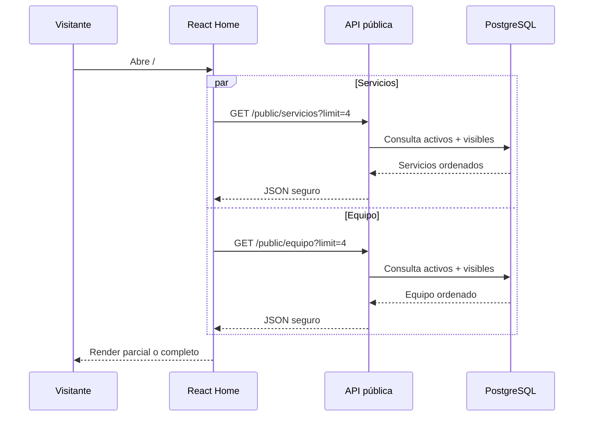
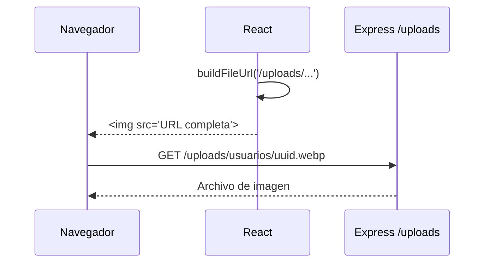

# Integración con la API pública — MVP

**Proyecto:** C.E.I.T. “Mentes Luminosas”  
**Versión:** 1.0.0

---

## 1. Objetivo

Definir cómo el frontend público obtiene servicios y equipo, construye URLs de imágenes, maneja fallos y evita exponer datos privados.

---

## 2. Fuentes de datos

| Contenido | Fuente |
|---|---|
| Servicios | API pública. |
| Equipo | API pública. |
| Imágenes de servicios/equipo | Backend `/uploads`. |
| Textos institucionales | `site.config.js`. |
| Contacto | `site.config.js`. |
| Obras sociales/prepagas | `site.config.js`. |
| Mapa | `site.config.js`. |
| Imágenes institucionales | `public/images/institucionales`. |

No existe endpoint público para contacto ni configuración institucional.

---

## 3. Endpoints

### 3.1 Equipo

```http
GET /api/v1/public/equipo
GET /api/v1/public/equipo?limit=4
```

Reglas del backend:

- `activo = true`;
- `visible_publicamente = true`;
- rol coordinación, secretaría o profesional;
- administrador excluido;
- `orden_publico ASC`, `apellido ASC`, `nombre ASC` como desempate;
- `limit` opcional, entero entre 1 y 50.

### 3.2 Servicios

```http
GET /api/v1/public/servicios
GET /api/v1/public/servicios?limit=4
```

Reglas:

- `activo = true`;
- `visible_publicamente = true`;
- `orden_publico ASC`, `nombre ASC`;
- `limit` opcional, entero entre 1 y 50.

---

## 4. Contrato de respuesta

Se recomienda mantener el envelope general del backend:

```json
{
  "data": [],
  "meta": {
    "count": 0
  }
}
```

No se necesita paginación pública en el MVP.

### 4.1 Integrante público

```json
{
  "id": "uuid",
  "nombre": "Valentina",
  "apellido": "Ríos",
  "titulo": "Licenciada en Psicopedagogía",
  "especialidad": "Psicopedagogía Clínica",
  "funcionPublica": "Psicopedagoga clínica",
  "bio": "Biografía pública completa...",
  "fotoUrl": "/uploads/usuarios/uuid.webp",
  "ordenPublico": 3
}
```

Campos prohibidos:

- DNI;
- `passwordHash`;
- email de acceso;
- teléfono personal;
- rol técnico;
- permisos;
- datos de sesión;
- auditoría.

### 4.2 Servicio público

```json
{
  "id": "uuid",
  "nombre": "Psicopedagogía Clínica",
  "descripcion": "Descripción completa...",
  "imagenUrl": "/uploads/servicios/uuid.webp",
  "ordenPublico": 1
}
```

El backend no expone campos internos innecesarios.

---

## 5. Cliente Axios

```js
import axios from 'axios';
import { env } from '@/config/env';

export const apiClient = axios.create({
  baseURL: env.apiBaseUrl,
  timeout: 10_000,
  headers: {
    Accept: 'application/json',
  },
});
```

El cliente público no necesita `withCredentials` ni interceptores de refresh.

---

## 6. Servicio público

```js
import { apiClient } from '@/services/apiClient';

export async function getPublicServices({ limit, signal } = {}) {
  const response = await apiClient.get('/public/servicios', {
    params: limit ? { limit } : undefined,
    signal,
  });

  return response.data.data;
}

export async function getPublicTeam({ limit, signal } = {}) {
  const response = await apiClient.get('/public/equipo', {
    params: limit ? { limit } : undefined,
    signal,
  });

  return response.data.data;
}
```

Las solicitudes se cancelan al desmontar la página para evitar actualizaciones tardías.

---

## 7. Hooks

Los hooks públicos encapsulan `loading`, `success`, `error`, cancelación y reintento. No almacenan datos sensibles ni persisten en `localStorage`.

```text
usePublicServices({ limit })
usePublicTeam({ limit })
```

Para evitar duplicación, puede crearse un hook genérico solo si su lectura sigue siendo clara para el equipo.

---

## 8. URLs de archivos

La base de archivos puede coincidir o no con la base de API.

```js
export function buildFileUrl(path) {
  if (!path) return null;
  if (/^https?:\/\//i.test(path)) return path;

  const base = import.meta.env.VITE_FILES_BASE_URL.replace(/\/$/, '');
  const normalized = path.startsWith('/') ? path : `/${path}`;
  return `${base}${normalized}`;
}
```

### 8.1 Restricción

El frontend no concatena rutas proporcionadas por usuarios finales. Usa únicamente rutas devueltas por endpoints públicos confiables.

---

## 9. Almacenamiento local del backend

### 9.1 Desarrollo

```text
api/uploads/usuarios/
api/uploads/servicios/
```

Express publica:

```text
/uploads
```

### 9.2 Git

Las imágenes cargadas no se versionan. Se conservan directorios mediante `.gitkeep`.

### 9.3 Producción futura

La elección de hosting queda pendiente. Si continúa el almacenamiento local, el proveedor debe ofrecer disco o volumen persistente. El backup debe incluir PostgreSQL y `uploads/`.

---

## 10. Carga de imágenes

La carga pertenece al panel privado y solo al administrador. Para conservar JSON en altas y ediciones, se recomiendan endpoints separados de imagen:

```http
PUT    /api/v1/usuarios/:id/foto
DELETE /api/v1/usuarios/:id/foto
PUT    /api/v1/servicios/:id/imagen
DELETE /api/v1/servicios/:id/imagen
```

`PUT` utiliza `multipart/form-data` con un campo `imagen`.

### 10.1 Motivo

- evita mezclar todos los formularios con multipart;
- mantiene contratos JSON existentes;
- facilita reemplazo y eliminación;
- permite reintentar la carga sin repetir el alta completa;
- simplifica tests.

Desde la perspectiva del usuario, el formulario puede ejecutar ambas operaciones al guardar y mostrar un único resultado.

### 10.2 Validaciones

- una imagen;
- JPEG, PNG o WebP;
- tamaño máximo 5 MB;
- MIME real validado;
- nombre generado por servidor;
- no utilizar el nombre original como ruta;
- nunca aceptar una ruta local enviada por el cliente.

---

## 11. CORS

El backend permite únicamente orígenes configurados.

Desarrollo:

```text
http://localhost:5173
```

Producción: dominio real del frontend.

Los archivos estáticos deben responder con cabeceras compatibles con la carga desde el frontend.

---

## 12. Manejo de errores

### 12.1 Normalización

```js
export function normalizePublicError(error) {
  if (error.name === 'CanceledError') return { type: 'canceled' };
  if (!error.response) return { type: 'network' };

  return {
    type: 'server',
    status: error.response.status,
    correlationId: error.response.data?.error?.correlationId ?? null,
  };
}
```

El `correlationId` puede mostrarse solo en un detalle de soporte discreto, nunca como mensaje principal.

### 12.2 Mensajes

- red: `No pudimos conectarnos. Revisá tu conexión e intentá nuevamente.`
- servidor: `No pudimos cargar esta información en este momento.`
- vacío: `La información se encuentra en actualización.`

### 12.3 Reintentos

No se ejecutan reintentos automáticos infinitos. El visitante puede reintentar manualmente. Un único reintento automático opcional ante errores transitorios puede evaluarse después, pero no es necesario.

---

## 13. Cache

Para el MVP, el navegador y el servidor pueden utilizar cache HTTP para imágenes. Los datos JSON pueden solicitarse al montar la página.

No se incorpora React Query ni Service Worker solo por cachear dos listados.

El backend puede configurar:

- imágenes con cache prolongada porque los nombres cambian al reemplazarlas;
- JSON público con cache corto o `ETag`.

---

## 14. Contacto

No existe:

```http
POST /api/v1/public/contacto
```

### WhatsApp

```js
export function createWhatsappUrl(number, message) {
  const digits = number.replace(/\D/g, '');
  return `https://wa.me/${digits}?text=${encodeURIComponent(message)}`;
}
```

### Correo

```js
export function createMailtoUrl(email, subject, body) {
  return `mailto:${email}?subject=${encodeURIComponent(subject)}&body=${encodeURIComponent(body)}`;
}
```

### Teléfono

```js
export function createTelUrl(phone) {
  return `tel:${phone.replace(/[^+\d]/g, '')}`;
}
```

Estas funciones no almacenan información.

---

## 15. Privacidad y observabilidad

- no enviar datos a analítica;
- no incluir contenido de WhatsApp o correo en logs;
- no registrar respuestas completas de la API en consola;
- no exponer errores del servidor;
- no solicitar datos privados en endpoints públicos;
- no incluir IDs internos en URLs visibles cuando no son necesarios;
- no utilizar `dangerouslySetInnerHTML` para biografías o descripciones.

---

## 16. Diagramas

### 16.1 Home



### 16.2 Imagen



---

## 17. Pruebas de contrato mínimas

- `limit=4` retorna como máximo cuatro registros.
- sin `limit` retorna todos los visibles.
- inactivos no aparecen.
- no visibles no aparecen.
- administrador no aparece en equipo.
- payload no contiene DNI, email de acceso, teléfono personal o rol técnico.
- orden estable.
- rutas de imagen relativas válidas.
- endpoint de contacto retorna 404 porque no existe.
- archivos inexistentes permiten fallback frontend.
