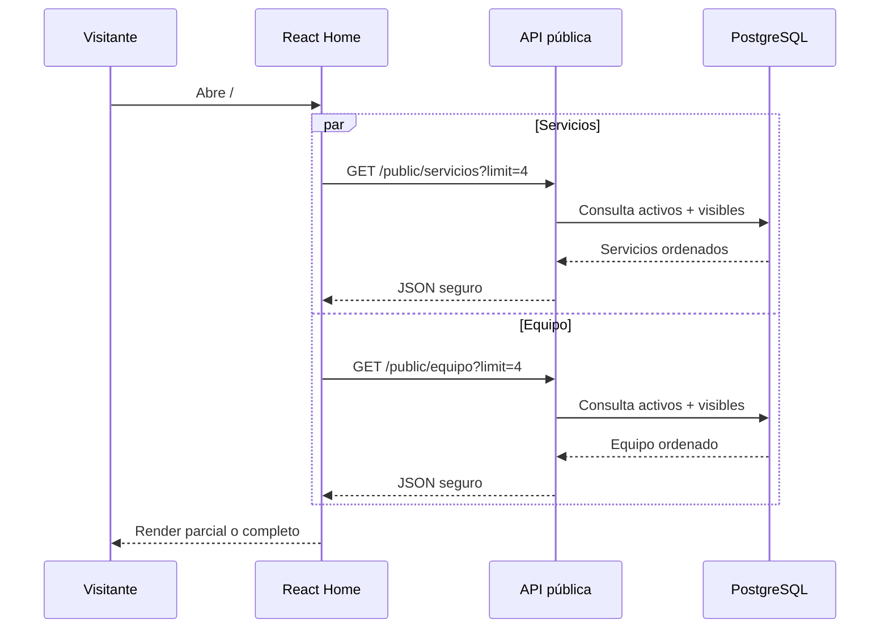
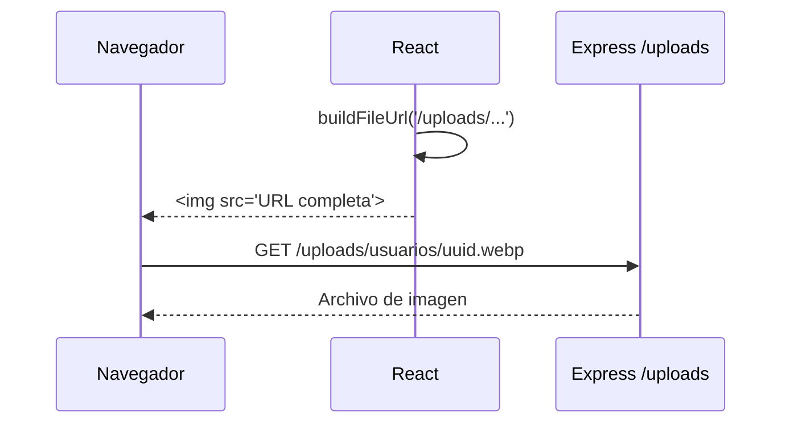

# Documentación consolidada del frontend público — MVP

**Proyecto:** C.E.I.T. “Mentes Luminosas”  
**Versión:** 1.0.0  
**Fecha:** 30 de julio de 2026

> Este documento concatena las piezas modulares. Para mantenimiento se recomienda editar los archivos individuales y volver a generar esta versión.


---

# Documentación del frontend público — MVP

**Proyecto:** Centro Educativo Interdisciplinar Terapéutico C.E.I.T. “Mentes Luminosas”  
**Versión documental:** 1.0.0  
**Fecha:** 30 de julio de 2026  
**Estado:** aprobado para implementación del área pública

---

## 1. Propósito

Este paquete consolida las decisiones funcionales, visuales y técnicas del **frontend público** del Producto Mínimo Viable. Su objetivo es que un equipo con poca experiencia pueda implementar el sitio sin improvisar rutas, contenidos, componentes, estilos, contratos de datos o comportamientos ante errores.

La documentación cubre exclusivamente:

- Home institucional;
- página Nosotros;
- página Servicios;
- página Nuestro equipo;
- página Contacto;
- página de Privacidad;
- navegación pública;
- acceso al login;
- consumo de servicios y equipo desde la API;
- sistema visual, accesibilidad, responsive design y SEO básico;
- integración de imágenes estáticas y dinámicas;
- plan de implementación y pruebas.

El panel privado se documentará en una etapa posterior.

---

## 2. Fuentes de verdad

Las fuentes se aplican en el siguiente orden de precedencia:

1. reglas de negocio y seguridad consolidadas del backend;
2. matriz de permisos y contrato API del backend;
3. decisiones confirmadas durante el diseño del frontend público;
4. este paquete documental;
5. `CONTENIDO-WEB-CEIT-MENTES-LUMINOSAS.md` como fuente del copy institucional;
6. prototipos, bocetos o implementaciones históricas.

Cuando este paquete difiere del contenido institucional original, la diferencia responde a una decisión expresamente confirmada. Ejemplos:

- no existe formulario público de contacto;
- obras sociales y prepagas tienen carácter informativo;
- no existe una galería ni carrusel de instalaciones;
- se utilizan seis imágenes institucionales junto al contenido;
- servicios y equipo son dinámicos;
- el resto del contenido institucional es estático;
- React Icons reemplaza la recomendación inicial de Lucide;
- las imágenes dinámicas se almacenan localmente en el backend durante el MVP.

---

## 3. Índice de documentos

| Documento | Responsabilidad |
|---|---|
| `01-ARQUITECTURA-FRONTEND-PUBLICO-MVP.md` | Stack, estructura, layouts, configuración, seguridad, SEO, estado y estrategia general. |
| `02-MAPA-PAGINAS-Y-CONTENIDOS-PUBLICOS-MVP.md` | Rutas, orden de secciones, contenido, CTAs, imágenes y estados por página. |
| `03-SISTEMA-DISENO-PUBLICO-MVP.md` | Design tokens, tipografía, componentes, iconografía, responsive design y accesibilidad. |
| `04-INTEGRACION-API-PUBLICA-MVP.md` | Contratos de servicios y equipo, URLs de archivos, carga, errores, CORS y seguridad. |
| `05-PLAN-IMPLEMENTACION-FRONTEND-PUBLICO-MVP.md` | Etapas, tareas, pruebas, Definition of Done, GitHub y control de calidad. |
| `06-AJUSTES-BACKEND-PARA-FRONTEND-PUBLICO-MVP.md` | Cambios obligatorios en base de datos, API, almacenamiento y documentación backend. |
| `07-REGISTRO-DECISIONES-PUBLICO-MVP.md` | Decisiones confirmadas, reemplazadas, fuera del MVP y pendientes reales. |
| `anexos/tokens-public.css` | Base ejecutable de variables CSS. |
| `anexos/site.config.example.js` | Ejemplo de configuración institucional estática. |
| `assets/institucionales/README.md` | Nombres, proporciones y uso de las seis fotografías institucionales. |

También se entrega:

- `DOCUMENTACION-FRONTEND-PUBLICO-MVP-CONSOLIDADA.md`;
- `SHA256SUMS.txt`;
- paquete ZIP completo.

---

## 4. Decisiones estructurales confirmadas

- Una única aplicación React + Vite contiene sitio público, login y panel privado.
- El sitio público es multipágina; la Home resume y deriva a páginas desarrolladas.
- Las rutas públicas son `/`, `/nosotros`, `/servicios`, `/equipo`, `/contacto` y `/privacidad`.
- El sitio público se diseña mobile-first.
- El panel privado será desktop-first responsive, pero no forma parte de este paquete.
- JavaScript ES6+ se utiliza en lugar de TypeScript para mantener coherencia con el backend y reducir la curva de aprendizaje.
- React Router administra las rutas.
- Axios consume la API.
- Redux Toolkit no se utiliza para los listados públicos simples; el estado es local a las páginas o hooks.
- React Icons es la única librería general de iconos.
- CSS Modules define estilos por componente y CSS Custom Properties centraliza la identidad visual.
- Servicios y equipo provienen de la API.
- Textos institucionales, obras sociales, datos de contacto, mapa y redes provienen de `site.config.js`.
- No existe CMS en el MVP.
- No existe formulario público ni endpoint de contacto.
- WhatsApp y correo se abren mediante enlaces externos.
- No se utiliza analítica, Meta Pixel ni cookies de seguimiento.
- El mapa completo aparece solo en `/contacto`.
- La Home muestra cuatro servicios y cuatro integrantes, seleccionados por `orden_publico`.
- Las páginas completas muestran todos los registros públicos sin filtros ni paginación.
- Coordinadora, secretaria y profesionales usan el mismo componente visual.
- Las biografías completas se muestran directamente en `/equipo`.
- Seis imágenes institucionales estáticas se distribuyen junto a textos: tres en Home y tres en Nosotros.
- Las imágenes dinámicas de usuarios y servicios se almacenan localmente en el backend; PostgreSQL guarda la ruta.

---

## 5. Datos ficticios y pendientes reales

El proyecto utiliza contenido de fantasía para diseñar el MVP. Antes de una publicación real deben reemplazarse o confirmarse:

- nombres del equipo;
- fotografías del equipo;
- listado y logotipos de obras sociales/prepagas;
- correo institucional;
- perfiles oficiales de redes sociales;
- URL definitiva del mapa;
- logo y favicon;
- seis fotografías institucionales;
- dominio y URLs de producción;
- textos legales definitivos y responsable del tratamiento de datos.

La aplicación no debe mostrar datos ficticios como si fueran reales en producción.

---

## 6. Convenciones

- Rutas y nombres de archivos: `kebab-case`.
- Componentes React: `PascalCase`.
- Variables y funciones JavaScript: `camelCase`.
- Variables CSS: español semántico con prefijo por dominio, por ejemplo `--color-primario-500`.
- Campos JSON: `camelCase`.
- Campos PostgreSQL: `snake_case`.
- No se duplican textos configurables dentro de componentes.
- No se escriben colores, fuentes, radios o espaciados reutilizables fuera de los tokens.
- No se importan iconos de familias diferentes sin justificación.
- No se exponen datos privados en el área pública.

---

## 7. Criterio de modificación

Una decisión confirmada solo se modifica mediante:

1. identificación de la necesidad;
2. análisis de impacto;
3. nueva decisión documentada;
4. actualización coordinada de frontend, API, base de datos y pruebas cuando corresponda.

No se cambia silenciosamente el contrato público ni el contenido que el backend expone.


---

# Arquitectura del frontend público — MVP

**Proyecto:** C.E.I.T. “Mentes Luminosas”  
**Versión:** 1.0.0  
**Estado:** aprobado para implementación

---

## 1. Objetivo

El frontend público presenta institucionalmente al centro, informa sus servicios, muestra el equipo, facilita el contacto y conduce al acceso privado. Debe ser:

- comprensible para familias;
- rápido en celulares;
- accesible;
- tolerante a fallos parciales;
- sencillo de implementar y mantener;
- coherente con la API y las reglas de privacidad;
- preparado para evolucionar sin introducir un CMS en el MVP.

No implementa reglas clínicas ni administrativas. Solo presenta contenido público y abre canales externos de contacto.

---

## 2. Alcance

### 2.1 Incluido

- layout público compartido;
- navegación responsive;
- Home;
- Nosotros;
- Servicios;
- Nuestro equipo;
- Contacto;
- Privacidad;
- enlace a Login;
- servicios y equipo desde la API;
- textos y datos institucionales desde configuración;
- SEO básico por ruta;
- imágenes estáticas y dinámicas;
- skeletons, estados vacíos, error y reintento;
- contacto por WhatsApp, teléfono y correo;
- mapa embebido únicamente en Contacto;
- obras sociales/prepagas estáticas e informativas;
- pruebas unitarias, de componentes e integración pública.

### 2.2 Fuera del MVP

- CMS;
- blog o noticias;
- reservas públicas de turnos;
- formulario de contacto;
- chatbot;
- autenticación de familias;
- páginas individuales de servicios;
- páginas individuales de integrantes;
- buscadores y filtros públicos;
- paginación pública;
- carruseles automáticos;
- galería de instalaciones;
- analítica y marketing pixels;
- cookies publicitarias;
- modo oscuro;
- internacionalización;
- aplicación móvil o PWA avanzada;
- SSR, SSG o framework adicional.

---

## 3. Stack

| Tecnología | Uso | Fundamento para el MVP |
|---|---|---|
| React | Componentes y composición de UI. | Conocido por el equipo y compartido con el panel privado. |
| Vite | Desarrollo y build. | Configuración simple y rápida. |
| JavaScript ES6+ | Lenguaje. | Reduce curva de aprendizaje y coincide con el backend CommonJS. |
| React Router | Rutas públicas, login y futuras rutas privadas. | Una única SPA con layouts diferenciados. |
| Axios | Consumo HTTP. | Interfaz conocida y reutilizable con el panel privado. |
| React Helmet Async | Metadatos por ruta. | SEO básico sin migrar a SSR. |
| React Icons | Iconografía. | Amplia cobertura y uso como componentes React. |
| CSS Modules | Estilos encapsulados. | Evita colisiones sin introducir CSS-in-JS. |
| CSS Custom Properties | Design tokens. | Fuente visual central, fácil de cambiar. |
| Vitest | Pruebas unitarias. | Integración natural con Vite. |
| React Testing Library | Pruebas de comportamiento. | Favorece pruebas centradas en el usuario. |
| Playwright | E2E público y luego privado. | Automatiza navegación real entre rutas. |

### 3.1 Dependencias mínimas

```bash
npm install react-router-dom axios react-helmet-async react-icons
npm install -D vitest @testing-library/react @testing-library/jest-dom @testing-library/user-event jsdom playwright
```

No se agregan librerías de componentes, animaciones o fetching mientras no exista una necesidad concreta.

---

## 4. Arquitectura general

```text
Navegador
  ↓
React Router
  ↓
PublicLayout
  ↓
Página pública
  ├── componentes estáticos
  ├── site.config.js
  └── hooks de datos públicos
        ↓
      publicApi.js
        ↓
      Axios
        ↓
API Express /api/v1/public
        ↓
PostgreSQL + archivos /uploads
```

La aplicación completa será una SPA, pero el área pública se organiza como un sitio multipágina mediante rutas semánticas.

---

## 5. Rutas y layouts

```text
/
/nosotros
/servicios
/equipo
/contacto
/privacidad
/login
/app/*
```

### 5.1 Layouts

- `PublicLayout`: header, contenido, footer y botón flotante de WhatsApp.
- `AuthLayout`: login y futuros estados de acceso.
- `PrivateLayout`: panel interno; se documentará después.

```jsx
<Route element={<PublicLayout />}>
  <Route index element={<HomePage />} />
  <Route path="nosotros" element={<AboutPage />} />
  <Route path="servicios" element={<ServicesPage />} />
  <Route path="equipo" element={<TeamPage />} />
  <Route path="contacto" element={<ContactPage />} />
  <Route path="privacidad" element={<PrivacyPage />} />
</Route>

<Route element={<AuthLayout />}>
  <Route path="login" element={<LoginPage />} />
</Route>
```

El `PublicLayout` ejecuta `ScrollToTop` en cambios de ruta, preserva foco accesible y no contiene lógica de negocio.

---

## 6. Estructura de carpetas

```text
client/
├── public/
│   ├── images/
│   │   ├── branding/
│   │   ├── institucionales/
│   │   ├── placeholders/
│   │   └── coberturas/
│   ├── robots.txt
│   └── sitemap.xml
│
├── src/
│   ├── app/
│   │   ├── App.jsx
│   │   ├── providers.jsx
│   │   └── router.jsx
│   │
│   ├── components/
│   │   ├── common/
│   │   ├── feedback/
│   │   ├── icons/
│   │   ├── layout/
│   │   └── public/
│   │
│   ├── config/
│   │   ├── env.js
│   │   ├── routes.js
│   │   └── site.config.js
│   │
│   ├── features/
│   │   ├── public-services/
│   │   │   ├── api/
│   │   │   ├── components/
│   │   │   └── hooks/
│   │   └── public-team/
│   │       ├── api/
│   │       ├── components/
│   │       └── hooks/
│   │
│   ├── layouts/
│   │   ├── PublicLayout.jsx
│   │   ├── AuthLayout.jsx
│   │   └── PrivateLayout.jsx
│   │
│   ├── pages/
│   │   ├── public/
│   │   │   ├── HomePage/
│   │   │   ├── AboutPage/
│   │   │   ├── ServicesPage/
│   │   │   ├── TeamPage/
│   │   │   ├── ContactPage/
│   │   │   └── PrivacyPage/
│   │   └── errors/
│   │
│   ├── services/
│   │   ├── apiClient.js
│   │   └── fileUrl.js
│   │
│   ├── styles/
│   │   ├── tokens.css
│   │   ├── reset.css
│   │   ├── globals.css
│   │   ├── utilities.css
│   │   └── index.css
│   │
│   ├── utils/
│   │   ├── contactLinks.js
│   │   ├── text.js
│   │   └── seo.js
│   │
│   └── main.jsx
│
├── .env.example
├── eslint.config.js
├── package.json
└── vite.config.js
```

### 6.1 Regla de sencillez

No se crea una carpeta o abstracción para un único archivo sin proyección de reutilización. La estructura puede comenzar más plana y evolucionar hacia este árbol a medida que se implementan páginas.

---

## 7. Contenido estático y dinámico

### 7.1 Estático en `site.config.js`

- nombre institucional;
- lema;
- introducciones;
- misión, visión y valores;
- teléfono y WhatsApp;
- correo;
- dirección;
- horarios;
- redes sociales;
- mapa;
- obras sociales/prepagas;
- mensajes predefinidos;
- metadatos SEO;
- rutas de imágenes institucionales.

### 7.2 Dinámico desde la API

- servicios publicados;
- imagen de cada servicio;
- nombre y descripción;
- orden público;
- integrantes publicados;
- fotografía;
- nombre, título, especialidad y función pública;
- biografía;
- orden público.

### 7.3 Sin CMS

Modificar textos institucionales requiere cambiar `site.config.js` y realizar un nuevo despliegue. Es una decisión deliberada para el MVP.

---

## 8. Estado

### 8.1 Estado local

Los listados públicos utilizan hooks con:

```text
status: idle | loading | success | error
data
error
retry()
```

La Home mantiene independientes el estado de servicios y el estado de equipo. Si falla uno, el otro continúa visible.

### 8.2 Redux

No se usa Redux para los datos públicos porque:

- son pocos;
- pertenecen a una o dos páginas;
- no requieren mutaciones públicas;
- no necesitan sincronización compleja.

Redux Toolkit quedará reservado para sesión, permisos, notificaciones y datos privados cuando se diseñe el panel.

---

## 9. Integración HTTP

La instancia Axios pública utiliza:

```js
const apiClient = axios.create({
  baseURL: env.apiBaseUrl,
  timeout: 10000,
});
```

No envía tokens ni credenciales a endpoints públicos. La misma base podrá extenderse luego para el cliente privado.

Variables:

```env
VITE_API_BASE_URL=http://localhost:3000/api/v1
VITE_FILES_BASE_URL=http://localhost:3000
VITE_SITE_URL=http://localhost:5173
```

Nunca se incluyen secretos en variables `VITE_*`, porque quedan visibles en el bundle.

---

## 10. Imágenes y archivos

### 10.1 Recursos versionados

```text
client/public/images/
```

Incluye logo, favicon, seis imágenes institucionales, placeholders y logotipos reales de coberturas.

### 10.2 Recursos dinámicos

```text
api/uploads/usuarios/
api/uploads/servicios/
```

La API guarda rutas relativas como:

```text
/uploads/usuarios/uuid.webp
/uploads/servicios/uuid.webp
```

El frontend construye la URL completa con `VITE_FILES_BASE_URL`.

### 10.3 Fallback

Si falta la ruta o la imagen produce error, el componente cambia una sola vez al placeholder correspondiente. No reintenta indefinidamente.

---

## 11. SEO básico

Cada página define:

- `<title>` único;
- descripción;
- canonical;
- Open Graph;
- Twitter Card básica;
- `robots`;
- schema.org apropiado cuando esté confirmado;
- encabezado H1 único;
- URLs semánticas.

### 11.1 Limitación aceptada

Una SPA no ofrece el mismo SEO inicial que SSR/SSG. Para el MVP se acepta porque reduce tecnologías y despliegues. Si el sitio necesita posicionamiento competitivo, se evaluará prerendering o separación del sitio público en una etapa posterior.

### 11.2 Datos estructurados

Puede utilizarse `LocalBusiness` o una categoría más específica solo después de confirmar que representa legalmente al centro. No se inventan acreditaciones, áreas médicas ni coberturas.

---

## 12. Seguridad y privacidad

- No se muestran DNI, correo de acceso, teléfono personal, rol técnico ni permisos.
- No se guardan formularios públicos.
- No se usan cookies de seguimiento.
- No se insertan contenidos HTML provenientes de la API mediante `dangerouslySetInnerHTML`.
- Los enlaces externos usan `rel="noopener noreferrer"` cuando abren una pestaña.
- Las URLs de archivos se construyen desde una base confiable y una ruta retornada por la API.
- No se registran datos sensibles en consola.
- Los errores visibles no incluyen stack traces ni mensajes internos.
- La política de privacidad diferencia claramente el área pública del área privada.

---

## 13. Accesibilidad

Objetivo de referencia: WCAG 2.1 AA.

- landmarks semánticos;
- skip link;
- navegación completa por teclado;
- foco visible;
- un H1 por página;
- jerarquía de encabezados;
- `alt` descriptivo para imágenes informativas;
- `alt=""` para imágenes decorativas;
- iconos importantes acompañados de texto;
- contraste suficiente;
- botones con área táctil mínima aproximada de 44 × 44 px;
- mensajes de carga y error comprensibles;
- respeto por `prefers-reduced-motion`;
- el menú móvil gestiona foco, Escape y cierre al navegar;
- iframe de mapa con `title`.

---

## 14. Rendimiento

- imágenes WebP y dimensiones explícitas;
- `loading="lazy"` fuera del Hero;
- Hero con `fetchpriority="high"` solo si corresponde;
- lazy loading por ruta para páginas no iniciales;
- importación individual de iconos;
- sin carruseles ni librerías visuales pesadas;
- skeletons con tamaño estable para evitar saltos;
- consultas independientes y limitadas en Home;
- no descargar listados completos para recortar cuatro en cliente si la API soporta `limit=4`.

---

## 15. Manejo de errores

### 15.1 Fallo parcial de Home

La página continúa renderizando. La sección afectada muestra:

- título;
- mensaje amable;
- botón Reintentar;
- acceso general a WhatsApp o correo cuando sea útil.

### 15.2 Página completa

`/servicios` y `/equipo` muestran error local y reintento. El header, footer y contacto continúan disponibles.

### 15.3 404

La ruta desconocida presenta:

- mensaje simple;
- enlace a Inicio;
- enlace a Contacto;
- sin detalles técnicos.

---

## 16. Build y despliegue

El primer objetivo es versionar todo en GitHub. No se elige proveedor de producción todavía.

La configuración debe ser portable:

```bash
npm run dev
npm run build
npm run preview
npm run lint
npm run test
npm run test:e2e
```

El host final debe redirigir rutas desconocidas a `index.html` para que React Router resuelva la SPA.

---

## 17. Criterios de aceptación arquitectónicos

- Todas las rutas públicas funcionan al navegar directamente por URL.
- El sitio funciona sin JavaScript de seguimiento.
- El fallo de la API no rompe contenido estático.
- El sitio público no depende del estado privado.
- Los componentes no contienen datos institucionales hardcodeados que correspondan a configuración.
- Los valores visuales reutilizables provienen de tokens.
- Las imágenes dinámicas usan una función única para construir URLs.
- El bundle no contiene secretos.
- El código es entendible para el equipo y no incorpora capas sin necesidad.


---

# Mapa de páginas y contenidos públicos — MVP

**Proyecto:** C.E.I.T. “Mentes Luminosas”  
**Versión:** 1.0.0

---

## 1. Mapa del sitio

```text
/
├── /nosotros
├── /servicios
├── /equipo
├── /contacto
├── /privacidad
└── /login
```

La Home resume la propuesta institucional. Las páginas internas desarrollan los temas principales.

---

## 2. Navegación pública

### 2.1 Header

Orden:

1. Logo, enlaza a `/`.
2. Inicio.
3. Nosotros.
4. Servicios.
5. Nuestro equipo.
6. Contacto.
7. Ingresar.

`Ingresar` se distingue visualmente, pero no compite con el contacto institucional.

### 2.2 Menú móvil

- botón con etiqueta accesible;
- panel desplegable o drawer simple;
- se cierra con Escape;
- se cierra al seleccionar una ruta;
- bloquea el scroll de fondo mientras está abierto;
- devuelve el foco al botón al cerrarse.

### 2.3 Footer

Incluye:

- nombre y logo;
- texto institucional breve;
- enlaces públicos;
- contacto;
- horario;
- redes configuradas;
- privacidad;
- acceso al sistema;
- copyright dinámico.

### 2.4 WhatsApp flotante

Aparece en todas las páginas públicas, excepto cuando interfiera con un diálogo. Tiene texto accesible y mensaje general predefinido.

---

# 3. Home `/`

## 3.1 Objetivo

Presentar el centro, explicar a quién acompaña, resumir servicios y equipo y facilitar el contacto.

## 3.2 Orden definitivo

1. Header.
2. Hero.
3. ¿A quiénes acompañamos?
4. Servicios destacados.
5. Cómo trabajamos.
6. Nuestro equipo.
7. El centro en números.
8. Obras sociales y prepagas.
9. Contacto resumido.
10. CTA final.
11. Footer.
12. WhatsApp flotante.

---

## 3.3 Hero

### Contenido

**Título visible:**

> Centro Educativo Interdisciplinar Terapéutico “Mentes Luminosas”

**Lema:**

> Donde el aprendizaje abraza la diversidad para encender el potencial de cada historia.

**Introducción:**

> En C.E.I.T. “Mentes Luminosas” acompañamos a niños, niñas y adolescentes en su desarrollo, y sostenemos a sus familias con un equipo interdisciplinario comprometido, cálido y profesional. Ubicados en Goya, Corrientes, ofrecemos un espacio de contención, diagnóstico y tratamiento integral para potenciar las capacidades de cada persona que nos elige.

### Acciones

- `Solicitar un turno`: abre WhatsApp general.
- `Conocer nuestros servicios`: navega a `/servicios`.

### Imagen

```text
/images/institucionales/home-hero.webp
```

Proporción recomendada: 16:10. En desarrollo se reserva el marco aunque el archivo todavía no exista.

---

## 3.4 ¿A quiénes acompañamos?

Se presenta por necesidades, no por grupos etarios.

### Bloques

#### Desarrollo neurocognitivo

> Acompañamos procesos vinculados al desarrollo de habilidades cognitivas, emocionales y adaptativas.

#### Dificultades de aprendizaje

> Brindamos apoyo ante desafíos relacionados con la lectura, la escritura, el cálculo y las trayectorias escolares.

#### Comunicación

> Trabajamos sobre el lenguaje, el habla y otras formas de expresión y comunicación.

#### Acompañamiento familiar

> Orientamos y sostenemos a las familias durante cada etapa del proceso educativo y terapéutico.

### Imagen contextual

```text
/images/institucionales/home-acompanamiento.webp
```

Proporción recomendada: 4:3. Se ubica junto al texto general de la sección; no forma una galería.

---

## 3.5 Servicios destacados

### Datos

```http
GET /api/v1/public/servicios?limit=4
```

### Orden

`orden_publico ASC`, luego `nombre ASC`.

### Tarjeta resumida

- imagen;
- nombre;
- fragmento de descripción;
- enlace para consultar por WhatsApp;
- toda la tarjeta o un enlace conduce a `/servicios` cuando corresponda.

No existe campo `destacado`. Los primeros cuatro son los destacados.

### Estado vacío

Si la API responde correctamente sin registros:

> Estamos actualizando la información de nuestros servicios.

### Error

> No pudimos cargar los servicios en este momento.

Acciones: Reintentar y Contacto general.

---

## 3.6 Cómo trabajamos

### Paso 1 — Primera escucha y orientación

> Se presenta el motivo de consulta, se conocen las necesidades iniciales y se orienta a la familia sobre los pasos a seguir.

### Paso 2 — Evaluación y planificación personalizada

> El equipo analiza cada situación y organiza un acompañamiento acorde con las características, necesidades y objetivos de cada niño, niña o adolescente.

### Paso 3 — Acompañamiento interdisciplinario

> Los profesionales trabajan de manera articulada, revisan los avances y sostienen la comunicación con la familia durante el proceso.

### Imagen contextual

```text
/images/institucionales/home-enfoque-interdisciplinario.webp
```

Proporción recomendada: 4:3.

---

## 3.7 Nuestro equipo

### Datos

```http
GET /api/v1/public/equipo?limit=4
```

### Orden esperado

1. coordinadora;
2. secretaria;
3. primer profesional;
4. segundo profesional.

El orden real se controla con `orden_publico`; no se codifica por rol en el frontend.

### Tarjeta resumida

- fotografía;
- nombre y apellido;
- título;
- función pública o especialidad;
- fragmento de biografía.

Todos usan el mismo componente visual.

CTA: `Conocer a todo el equipo` → `/equipo`.

---

## 3.8 El centro en números

Contenido inicial de fantasía:

- 1 coordinadora;
- 1 secretaria;
- 8 profesionales;
- 6 disciplinas.

### Regla

Los números deben centralizarse en configuración o derivarse de la API cuando sean confiables. No se repiten en varios componentes.

La sección no promete resultados clínicos ni métricas de atención.

---

## 3.9 Obras sociales y prepagas

Carácter exclusivamente informativo.

- contenido estático;
- sin consulta exclusiva;
- sin mensaje de WhatsApp dedicado;
- sin tabla ni endpoint;
- se muestra solo cuando existe un listado real;
- puede incluir nombres y logotipos autorizados.

Si no hay datos confirmados, la sección no se renderiza.

---

## 3.10 Contacto resumido

Muestra:

- Calle España 930, Goya, Corrientes;
- lunes a viernes, 8:00 a 21:00;
- teléfono/WhatsApp;
- correo si está confirmado;
- enlace `Cómo llegar`.

No incluye mapa embebido.

---

## 3.11 CTA final

Texto base:

> Cada proceso comienza con una conversación. Nuestro equipo está disponible para orientarte y ayudarte a encontrar el acompañamiento adecuado.

Acciones:

- Escribir por WhatsApp.
- Enviar un correo, si está configurado.

---

# 4. Nosotros `/nosotros`

## 4.1 Objetivo

Desarrollar identidad, misión, visión, valores y enfoque sin inventar historia cronológica.

## 4.2 Orden

1. encabezado de página;
2. quiénes somos y razón de ser;
3. misión;
4. visión;
5. valores;
6. enfoque interdisciplinario;
7. a quiénes acompañamos;
8. CTA final.

## 4.3 Quiénes somos

> C.E.I.T. “Mentes Luminosas” es un Centro Educativo Interdisciplinar Terapéutico ubicado en la ciudad de Goya, Corrientes, dedicado al abordaje integral del desarrollo infantojuvenil. Nacimos con la convicción de que cada niño, niña y adolescente tiene una historia única, y que el verdadero aprendizaje ocurre cuando ese potencial individual es reconocido, respetado y estimulado desde la diversidad.

> Nuestro nombre resume nuestra misión: ser un espacio donde la educación y la terapia se entrelazan para iluminar el camino de cada familia que nos confía su proceso.

Imagen:

```text
/images/institucionales/nosotros-identidad.webp
```

## 4.4 Misión

> Brindar un acompañamiento terapéutico y educativo integral a niños, niñas y adolescentes con desafíos en su desarrollo neurocognitivo, trastornos del aprendizaje, dificultades en la comunicación o condiciones del espectro autista, mediante un equipo interdisciplinario que trabaja de manera coordinada, humana y basada en evidencia, sosteniendo también a las familias en cada etapa del proceso.

## 4.5 Visión

> Ser un centro de referencia en Goya y la región en el abordaje interdisciplinario del neurodesarrollo infantojuvenil, reconocido por la calidad profesional de su equipo, la calidez de su atención y su compromiso genuino con la inclusión y el bienestar de cada familia.

## 4.6 Valores

- Diversidad.
- Compromiso.
- Trabajo interdisciplinario.
- Contención familiar.
- Calidez humana.

Imagen junto al bloque de misión, visión y valores:

```text
/images/institucionales/nosotros-valores.webp
```

## 4.7 Enfoque interdisciplinario

> En C.E.I.T. trabajamos bajo un modelo donde las distintas disciplinas dialogan entre sí. Cada niño o niña cuenta con un equipo de profesionales que se comunican y ajustan estrategias en conjunto, evitando abordajes aislados y logrando una mirada integral sobre cada proceso. Las familias son parte activa de este recorrido, recibiendo orientación y acompañamiento constante.

Imagen:

```text
/images/institucionales/nosotros-espacio.webp
```

## 4.8 Sin galería

Las tres imágenes se ubican junto a su contenido. No se agrupan, amplían en modal ni se presentan como carrusel.

---

# 5. Servicios `/servicios`

## 5.1 Objetivo

Mostrar todos los servicios públicos con información completa y acciones generales de contacto.

## 5.2 Orden

1. encabezado;
2. introducción;
3. lista completa;
4. obras sociales/prepagas si están configuradas;
5. CTA final.

## 5.3 Datos

```http
GET /api/v1/public/servicios
```

Solo servicios activos y visibles públicamente.

## 5.4 Componente

`ServiceDetailCard` contiene:

- imagen 4:3;
- icono decorativo;
- nombre;
- descripción completa;
- WhatsApp con mensaje por servicio;
- correo con asunto por servicio, si existe email.

En escritorio alterna imagen/texto. En móvil siempre imagen seguida de contenido.

## 5.5 Sin funcionalidades innecesarias

No hay:

- búsqueda;
- filtro;
- paginación;
- página individual;
- campo destinatarios;
- campo objetivo;
- campo modalidad;
- destacado independiente.

Esos contenidos pueden formar parte de `descripcion`.

## 5.6 Mensajes

WhatsApp:

> Hola, quisiera recibir información sobre el servicio de {nombreServicio} de C.E.I.T. Mentes Luminosas.

Correo:

- Asunto: `Consulta sobre {nombreServicio}`.
- Cuerpo: `Hola, quisiera recibir información sobre el servicio de {nombreServicio}.`

---

# 6. Nuestro equipo `/equipo`

## 6.1 Objetivo

Presentar coordinadora, secretaria y profesionales con igual jerarquía visual.

## 6.2 Datos

```http
GET /api/v1/public/equipo
```

## 6.3 Campos

- fotografía;
- nombre;
- apellido;
- título;
- función pública;
- especialidad;
- biografía completa.

## 6.4 Orden

Se respeta `orden_publico`. La carga administrativa debe asignar primero coordinadora, después secretaria y luego profesionales.

## 6.5 Diseño

Todos usan `TeamMemberCard` con el mismo tamaño, tipografía y estructura. No hay tarjetas destacadas para coordinación o secretaría.

La biografía completa aparece directamente. No hay `Ver más`, filtros, búsqueda, paginación ni páginas individuales.

---

# 7. Contacto `/contacto`

## 7.1 Objetivo

Presentar canales y ubicación sin almacenar consultas.

## 7.2 Orden

1. encabezado;
2. WhatsApp y correo;
3. teléfono, dirección y horarios;
4. mapa;
5. redes configuradas;
6. información institucional breve.

## 7.3 Canales

### WhatsApp

Mensaje:

> Hola, me gustaría recibir información sobre C.E.I.T. Mentes Luminosas.

### Correo

- Asunto: `Consulta desde el sitio web`.
- Cuerpo: `Hola, quisiera recibir información sobre C.E.I.T. Mentes Luminosas.`

### Teléfono

Enlace `tel:` independiente, aunque el número coincida con WhatsApp.

## 7.4 Mapa

- iframe configurable;
- `title` descriptivo;
- lazy loading;
- enlace externo `Cómo llegar`;
- no usa Google Maps JavaScript API;
- no necesita lógica propia de geolocalización.

## 7.5 Datos opcionales

Si correo o red social no están configurados, el bloque no aparece.

---

# 8. Privacidad `/privacidad`

## 8.1 Alcance

Página informativa inicial, revisable por asesoramiento legal antes de producción.

## 8.2 Contenido mínimo

- identificación del responsable institucional;
- diferencia entre área pública y privada;
- ausencia de formulario público;
- ausencia de analítica y cookies de seguimiento;
- apertura de WhatsApp y correo en servicios externos;
- uso de mapa y redes externas;
- finalidad de los datos tratados en el área privada;
- canal de contacto para derechos de acceso, rectificación o actualización;
- fecha de última actualización.

## 8.3 No afirmar sin confirmar

- base legal específica;
- registros oficiales;
- certificaciones;
- plazos de conservación;
- transferencias internacionales;
- dominio legal del responsable.

Esos puntos deben completarse con información real.

---

# 9. Estados comunes

## 9.1 Loading

Skeletons con dimensiones cercanas al contenido final. No se muestra spinner de página completa para solicitudes de secciones.

## 9.2 Empty

El vacío correcto se diferencia del error.

## 9.3 Error

Mensaje no técnico y botón Reintentar.

## 9.4 Imagen faltante

- desarrollo: marco con nombre esperado;
- producción: placeholder neutro.

## 9.5 Offline

Mensaje general:

> Parece que no hay conexión. Revisá tu acceso a internet e intentá nuevamente.

---

# 10. Matriz de rutas

| Ruta | Datos dinámicos | Imagen estática | CTA principal | SEO indexable |
|---|---|---|---|---:|
| `/` | 4 servicios, 4 integrantes | 3 imágenes | WhatsApp | Sí |
| `/nosotros` | No | 3 imágenes | Contacto | Sí |
| `/servicios` | Todos los servicios | No | Contacto | Sí |
| `/equipo` | Todo el equipo | No | Contacto | Sí |
| `/contacto` | No | No | WhatsApp/email | Sí |
| `/privacidad` | No | No | Contacto institucional | Sí |
| `/login` | Autenticación privada | Branding | Ingresar | No recomendado |

---

# 11. Criterios de aceptación de contenido

- La Home contiene exactamente tres fotografías institucionales contextuales.
- Nosotros contiene exactamente tres fotografías institucionales contextuales.
- No existe galería ni carrusel.
- Servicios y equipo se muestran según orden público.
- Obras sociales no generan un flujo exclusivo de consulta.
- Contacto no tiene formulario.
- El correo se oculta si no está confirmado.
- Los nombres ficticios no se publican en producción.
- Cada página tiene un H1 único y contenido comprensible sin depender de iconos.


---

# Sistema de diseño público — MVP

**Proyecto:** C.E.I.T. “Mentes Luminosas”  
**Versión:** 1.0.0

---

## 1. Principio

Toda decisión visual reutilizable se expresa como un token. Los componentes no deben contener valores arbitrarios de color, tipografía, espaciado, radio, sombra o z-index.

La fuente principal es:

```text
client/src/styles/tokens.css
```

CSS Modules consume los tokens y define la estructura de cada componente.

---

## 2. Identidad visual

### 2.1 Intención

- profesional;
- cálida;
- calma;
- inclusiva;
- baja sobrecarga visual;
- apropiada para familias y personas neurodivergentes;
- legible en celulares.

### 2.2 Paleta confirmada

| Rol | Valor base |
|---|---|
| Primario | `#2E6F6E` |
| Primario oscuro | `#1F4E4D` |
| Acento cálido | `#C77B4B` |
| Fondo | `#F7F9F8` |
| Superficie | `#FFFFFF` |
| Texto principal | `#243333` |
| Texto secundario | `#5E6B6B` |

Los componentes usan variables semánticas como `--color-texto-principal`, no hexadecimales.

---

## 3. Tipografía

### 3.1 Familias

- títulos: Nunito;
- cuerpo e interfaz: Inter;
- fallbacks del sistema cuando no carguen fuentes web.

### 3.2 Carga

Preferencia:

1. archivos autoalojados si se dispone de licencia y archivos adecuados;
2. proveedor externo solo si se acepta su impacto de privacidad;
3. fallback de sistema.

No se incluyen archivos de fuente dentro de esta entrega.

### 3.3 Jerarquía

- Display: Hero.
- H1: título de página.
- H2: título de sección.
- H3: tarjeta o subsección.
- Subtitle: introducción de sección.
- Body: párrafo común.
- Small: notas, horarios y metadatos.

Los tamaños usan `clamp()` para responder fluidamente.

---

## 4. Arquitectura CSS

```text
styles/
├── tokens.css
├── reset.css
├── globals.css
├── utilities.css
└── index.css
```

### 4.1 `tokens.css`

Identidad y escalas.

### 4.2 `reset.css`

Normalización controlada: box sizing, imágenes, formularios y márgenes.

### 4.3 `globals.css`

`body`, headings, párrafos, enlaces, selección, foco y contenedor.

### 4.4 `utilities.css`

Solo utilidades repetidas y estables, por ejemplo `.srOnly`, `.container` y `.skipLink`.

### 4.5 CSS Modules

Un archivo por componente o página:

```text
ServiceCard.jsx
ServiceCard.module.css
```

---

## 5. Tokens obligatorios

El anexo `tokens-public.css` incluye:

- escala primaria, acento y neutros;
- colores semánticos;
- estados;
- familias y pesos;
- tamaños de display, títulos, subtítulos, párrafos y textos pequeños;
- interlineado y ancho de lectura;
- espaciado;
- contenedores;
- radios y bordes;
- sombras;
- transiciones;
- z-index;
- header, secciones, cards, botones, inputs, iconos, imágenes y skeletons.

### Regla

```css
/* Incorrecto */
.card { padding: 23px; color: #243333; }

/* Correcto */
.card {
  padding: var(--card-padding);
  color: var(--color-texto-principal);
}
```

---

## 6. Breakpoints

Los breakpoints no pueden consumirse como variables CSS dentro de media queries nativas. Se documentan y se repiten únicamente en archivos de layout.

```text
mobile: 0–640 px
tablet: 641–1024 px
desktop: 1025 px o más
```

El diseño se adapta por contenido, no por modelos de dispositivos.

---

## 7. Responsive design

### 7.1 Mobile-first

Los estilos base representan móvil. Las mejoras para tablet y escritorio se agregan con `min-width`.

### 7.2 Layout de texto e imagen

Móvil:

```text
Texto
Imagen
```

Escritorio:

```text
Texto | Imagen
Imagen | Texto
```

La alternancia es visual; el orden DOM mantiene lectura lógica cuando sea posible.

### 7.3 Cards

- Home: una columna móvil, dos tablet, hasta cuatro escritorio.
- Servicios completos: bloque vertical móvil y horizontal escritorio.
- Equipo completo: bloque vertical móvil y horizontal o grilla amplia escritorio según longitud de bio.

### 7.4 Header

- escritorio: navegación visible;
- móvil: botón de menú y panel;
- logo con dimensiones reservadas para evitar salto de layout.

---

## 8. Iconografía

### 8.1 Librería

```bash
npm install react-icons
```

### 8.2 Familias

- interfaz: `react-icons/fa6`;
- marcas: `react-icons/si`.

No se mezclan libremente otras familias.

### 8.3 Imports

```js
import { FaEnvelope, FaLocationDot } from 'react-icons/fa6';
import { SiFacebook, SiInstagram, SiWhatsapp } from 'react-icons/si';
```

### 8.4 Reglas

- importar iconos individualmente;
- acciones críticas incluyen texto;
- decorativos usan `aria-hidden="true"`;
- iconos solos requieren `aria-label` o texto oculto;
- no usar emojis como sistema de iconos;
- color y tamaño provienen de tokens;
- logos de marcas conservan reconocimiento, sin convertir toda la UI en colores de marca.

### 8.5 Catálogo inicial

- navegación: casa, información, servicios, equipo, contacto, ingresar;
- contacto: WhatsApp, correo, teléfono, ubicación, reloj, navegación;
- necesidades: cerebro, libro, comentarios, manos;
- proceso: conversación, clipboard, equipo;
- acciones: flecha, chevron, externo, reintentar;
- feedback: círculo de alerta, check, info.

---

## 9. Componentes públicos

### 9.1 Layout

- `PublicHeader`;
- `PublicNavigation`;
- `MobileMenu`;
- `PublicFooter`;
- `WhatsappFloatingButton`;
- `PageContainer`;
- `Section`;
- `SectionHeader`;
- `TextImageSection`.

### 9.2 Contenido

- `HeroSection`;
- `NeedCard`;
- `ProcessStep`;
- `ServicePreviewCard`;
- `ServiceDetailCard`;
- `TeamMemberPreviewCard`;
- `TeamMemberCard`;
- `StatCard`;
- `CoverageList`;
- `ContactChannelCard`;
- `InstitutionalImage`;
- `Seo`.

### 9.3 Feedback

- `SkeletonCard`;
- `SectionLoading`;
- `SectionError`;
- `EmptyState`;
- `ImageFallback`;
- `NotFoundState`.

### 9.4 Controles

- `Button`;
- `LinkButton`;
- `IconButton`;
- `ExternalLink`.

No se crea una biblioteca de UI completa antes de utilizar estos componentes.

---

## 10. Botones

Variantes:

- primary: acción principal;
- secondary: acción alternativa;
- ghost: navegación o acción menor;
- external: mantiene estilo de botón pero indica apertura externa.

Estados:

- default;
- hover;
- focus-visible;
- active;
- disabled;
- loading, solo cuando exista una operación real.

Los enlaces que navegan deben seguir siendo `<a>` o `Link`; no se convierten en `<button>` por estilo.

---

## 11. Imágenes institucionales

Nombres definitivos:

```text
home-hero.webp
home-acompanamiento.webp
home-enfoque-interdisciplinario.webp
nosotros-identidad.webp
nosotros-valores.webp
nosotros-espacio.webp
```

### 11.1 Reglas

- Hero: 16:10, sugerido 1600 × 1000.
- Resto: 4:3, sugerido 1200 × 900.
- `object-fit: cover`.
- bordes suaves por token.
- dimensiones conocidas para evitar CLS.
- no hay galería, lightbox o carrusel.

### 11.2 Marco durante desarrollo

`InstitutionalImage` muestra el nombre esperado cuando el archivo falta en modo desarrollo. En producción usa un placeholder neutro.

---

## 12. Imágenes dinámicas

### 12.1 Equipo

- proporción 1:1;
- sugerido 600 × 600;
- placeholder de persona;
- alt con nombre completo cuando existe fotografía.

### 12.2 Servicios

- proporción 4:3;
- sugerido 1200 × 900;
- placeholder de servicio;
- alt descriptivo basado en el servicio, sin afirmar contenido visual no verificado.

---

## 13. Skeletons

- no deben simular contenido indefinidamente;
- mantienen dimensiones finales;
- respetan reducción de movimiento;
- no requieren lectores de pantalla por cada bloque;
- el contenedor puede anunciar `Cargando servicios` mediante texto oculto o `aria-live` moderado.

---

## 14. Accesibilidad visual

- contraste AA verificado con valores reales;
- texto de cuerpo mínimo 16 px por defecto;
- ancho de lectura alrededor de 65–70 caracteres;
- interlineado 1.6 o superior para párrafos largos;
- no justificar texto;
- no usar mayúsculas extensas;
- foco de alto contraste;
- estados no dependen solo del color;
- animaciones discretas;
- sin fondos visualmente ruidosos detrás de texto.

---

## 15. Movimiento

Permitido:

- transiciones breves de color, sombra y desplazamiento mínimo;
- apertura del menú;
- skeleton suave si no afecta accesibilidad.

No permitido en el MVP:

- autoplay;
- parallax;
- animaciones de entrada en cada scroll;
- contadores animados;
- texto rotatorio;
- fondos en video.

---

## 16. Logo y branding

Rutas esperadas:

```text
/public/images/branding/logo.svg
/public/images/branding/logo-horizontal.svg
/public/images/branding/favicon.svg
```

Si solo existe un logo, `logo.svg` es suficiente. El componente define un fallback tipográfico con el nombre del centro durante desarrollo.

---

## 17. Criterios de aceptación visuales

- Cambiar colores principales requiere editar únicamente tokens.
- Cambiar fuentes y jerarquía tipográfica requiere editar tokens y carga global, no componentes.
- No existen hexadecimales repetidos en CSS Modules.
- React Icons conserva una familia coherente.
- La página es legible a 320 px de ancho.
- El zoom al 200 % no pierde contenido ni acciones.
- La navegación funciona por teclado.
- No hay carruseles ni galerías.
- Imágenes faltantes no producen iconos rotos.


---

# Integración con la API pública — MVP

**Proyecto:** C.E.I.T. “Mentes Luminosas”  
**Versión:** 1.0.0

---

## 1. Objetivo

Definir cómo el frontend público obtiene servicios y equipo, construye URLs de imágenes, maneja fallos y evita exponer datos privados.

---

## 2. Fuentes de datos

| Contenido | Fuente |
|---|---|
| Servicios | API pública. |
| Equipo | API pública. |
| Imágenes de servicios/equipo | Backend `/uploads`. |
| Textos institucionales | `site.config.js`. |
| Contacto | `site.config.js`. |
| Obras sociales/prepagas | `site.config.js`. |
| Mapa | `site.config.js`. |
| Imágenes institucionales | `public/images/institucionales`. |

No existe endpoint público para contacto ni configuración institucional.

---

## 3. Endpoints

### 3.1 Equipo

```http
GET /api/v1/public/equipo
GET /api/v1/public/equipo?limit=4
```

Reglas del backend:

- `activo = true`;
- `visible_publicamente = true`;
- rol coordinación, secretaría o profesional;
- administrador excluido;
- `orden_publico ASC`, `apellido ASC`, `nombre ASC` como desempate;
- `limit` opcional, entero entre 1 y 50.

### 3.2 Servicios

```http
GET /api/v1/public/servicios
GET /api/v1/public/servicios?limit=4
```

Reglas:

- `activo = true`;
- `visible_publicamente = true`;
- `orden_publico ASC`, `nombre ASC`;
- `limit` opcional, entero entre 1 y 50.

---

## 4. Contrato de respuesta

Se recomienda mantener el envelope general del backend:

```json
{
  "data": [],
  "meta": {
    "count": 0
  }
}
```

No se necesita paginación pública en el MVP.

### 4.1 Integrante público

```json
{
  "id": "uuid",
  "nombre": "Valentina",
  "apellido": "Ríos",
  "titulo": "Licenciada en Psicopedagogía",
  "especialidad": "Psicopedagogía Clínica",
  "funcionPublica": "Psicopedagoga clínica",
  "bio": "Biografía pública completa...",
  "fotoUrl": "/uploads/usuarios/uuid.webp",
  "ordenPublico": 3
}
```

Campos prohibidos:

- DNI;
- `passwordHash`;
- email de acceso;
- teléfono personal;
- rol técnico;
- permisos;
- datos de sesión;
- auditoría.

### 4.2 Servicio público

```json
{
  "id": "uuid",
  "nombre": "Psicopedagogía Clínica",
  "descripcion": "Descripción completa...",
  "imagenUrl": "/uploads/servicios/uuid.webp",
  "ordenPublico": 1
}
```

El backend no expone campos internos innecesarios.

---

## 5. Cliente Axios

```js
import axios from 'axios';
import { env } from '@/config/env';

export const apiClient = axios.create({
  baseURL: env.apiBaseUrl,
  timeout: 10_000,
  headers: {
    Accept: 'application/json',
  },
});
```

El cliente público no necesita `withCredentials` ni interceptores de refresh.

---

## 6. Servicio público

```js
import { apiClient } from '@/services/apiClient';

export async function getPublicServices({ limit, signal } = {}) {
  const response = await apiClient.get('/public/servicios', {
    params: limit ? { limit } : undefined,
    signal,
  });

  return response.data.data;
}

export async function getPublicTeam({ limit, signal } = {}) {
  const response = await apiClient.get('/public/equipo', {
    params: limit ? { limit } : undefined,
    signal,
  });

  return response.data.data;
}
```

Las solicitudes se cancelan al desmontar la página para evitar actualizaciones tardías.

---

## 7. Hooks

Los hooks públicos encapsulan `loading`, `success`, `error`, cancelación y reintento. No almacenan datos sensibles ni persisten en `localStorage`.

```text
usePublicServices({ limit })
usePublicTeam({ limit })
```

Para evitar duplicación, puede crearse un hook genérico solo si su lectura sigue siendo clara para el equipo.

---

## 8. URLs de archivos

La base de archivos puede coincidir o no con la base de API.

```js
export function buildFileUrl(path) {
  if (!path) return null;
  if (/^https?:\/\//i.test(path)) return path;

  const base = import.meta.env.VITE_FILES_BASE_URL.replace(/\/$/, '');
  const normalized = path.startsWith('/') ? path : `/${path}`;
  return `${base}${normalized}`;
}
```

### 8.1 Restricción

El frontend no concatena rutas proporcionadas por usuarios finales. Usa únicamente rutas devueltas por endpoints públicos confiables.

---

## 9. Almacenamiento local del backend

### 9.1 Desarrollo

```text
api/uploads/usuarios/
api/uploads/servicios/
```

Express publica:

```text
/uploads
```

### 9.2 Git

Las imágenes cargadas no se versionan. Se conservan directorios mediante `.gitkeep`.

### 9.3 Producción futura

La elección de hosting queda pendiente. Si continúa el almacenamiento local, el proveedor debe ofrecer disco o volumen persistente. El backup debe incluir PostgreSQL y `uploads/`.

---

## 10. Carga de imágenes

La carga pertenece al panel privado y solo al administrador. Para conservar JSON en altas y ediciones, se recomiendan endpoints separados de imagen:

```http
PUT    /api/v1/usuarios/:id/foto
DELETE /api/v1/usuarios/:id/foto
PUT    /api/v1/servicios/:id/imagen
DELETE /api/v1/servicios/:id/imagen
```

`PUT` utiliza `multipart/form-data` con un campo `imagen`.

### 10.1 Motivo

- evita mezclar todos los formularios con multipart;
- mantiene contratos JSON existentes;
- facilita reemplazo y eliminación;
- permite reintentar la carga sin repetir el alta completa;
- simplifica tests.

Desde la perspectiva del usuario, el formulario puede ejecutar ambas operaciones al guardar y mostrar un único resultado.

### 10.2 Validaciones

- una imagen;
- JPEG, PNG o WebP;
- tamaño máximo 5 MB;
- MIME real validado;
- nombre generado por servidor;
- no utilizar el nombre original como ruta;
- nunca aceptar una ruta local enviada por el cliente.

---

## 11. CORS

El backend permite únicamente orígenes configurados.

Desarrollo:

```text
http://localhost:5173
```

Producción: dominio real del frontend.

Los archivos estáticos deben responder con cabeceras compatibles con la carga desde el frontend.

---

## 12. Manejo de errores

### 12.1 Normalización

```js
export function normalizePublicError(error) {
  if (error.name === 'CanceledError') return { type: 'canceled' };
  if (!error.response) return { type: 'network' };

  return {
    type: 'server',
    status: error.response.status,
    correlationId: error.response.data?.error?.correlationId ?? null,
  };
}
```

El `correlationId` puede mostrarse solo en un detalle de soporte discreto, nunca como mensaje principal.

### 12.2 Mensajes

- red: `No pudimos conectarnos. Revisá tu conexión e intentá nuevamente.`
- servidor: `No pudimos cargar esta información en este momento.`
- vacío: `La información se encuentra en actualización.`

### 12.3 Reintentos

No se ejecutan reintentos automáticos infinitos. El visitante puede reintentar manualmente. Un único reintento automático opcional ante errores transitorios puede evaluarse después, pero no es necesario.

---

## 13. Cache

Para el MVP, el navegador y el servidor pueden utilizar cache HTTP para imágenes. Los datos JSON pueden solicitarse al montar la página.

No se incorpora React Query ni Service Worker solo por cachear dos listados.

El backend puede configurar:

- imágenes con cache prolongada porque los nombres cambian al reemplazarlas;
- JSON público con cache corto o `ETag`.

---

## 14. Contacto

No existe:

```http
POST /api/v1/public/contacto
```

### WhatsApp

```js
export function createWhatsappUrl(number, message) {
  const digits = number.replace(/\D/g, '');
  return `https://wa.me/${digits}?text=${encodeURIComponent(message)}`;
}
```

### Correo

```js
export function createMailtoUrl(email, subject, body) {
  return `mailto:${email}?subject=${encodeURIComponent(subject)}&body=${encodeURIComponent(body)}`;
}
```

### Teléfono

```js
export function createTelUrl(phone) {
  return `tel:${phone.replace(/[^+\d]/g, '')}`;
}
```

Estas funciones no almacenan información.

---

## 15. Privacidad y observabilidad

- no enviar datos a analítica;
- no incluir contenido de WhatsApp o correo en logs;
- no registrar respuestas completas de la API en consola;
- no exponer errores del servidor;
- no solicitar datos privados en endpoints públicos;
- no incluir IDs internos en URLs visibles cuando no son necesarios;
- no utilizar `dangerouslySetInnerHTML` para biografías o descripciones.

---

## 16. Diagramas

### 16.1 Home



### 16.2 Imagen



---

## 17. Pruebas de contrato mínimas

- `limit=4` retorna como máximo cuatro registros.
- sin `limit` retorna todos los visibles.
- inactivos no aparecen.
- no visibles no aparecen.
- administrador no aparece en equipo.
- payload no contiene DNI, email de acceso, teléfono personal o rol técnico.
- orden estable.
- rutas de imagen relativas válidas.
- endpoint de contacto retorna 404 porque no existe.
- archivos inexistentes permiten fallback frontend.


---

# Plan de implementación del frontend público — MVP

**Proyecto:** C.E.I.T. “Mentes Luminosas”  
**Versión:** 1.0.0

---

## 1. Estrategia

Se implementa por etapas verticales pequeñas. Cada etapa deja una porción navegable, probada y documentada.

Orden general:

```text
bootstrap
→ diseño base
→ layout y rutas
→ Home estática
→ Nosotros
→ API pública
→ Servicios
→ Equipo
→ Contacto
→ Privacidad y SEO
→ accesibilidad
→ pruebas E2E
→ estabilización
```

No se comienza el panel privado hasta cerrar los criterios del área pública o dejar claramente aisladas las tareas pendientes.

---

## 2. Etapa 0 — Preparación del repositorio

### Tareas

- crear o validar monorepo con `api/` y `client/`;
- inicializar React con Vite;
- configurar ESLint y Prettier;
- agregar scripts;
- crear `.env.example`;
- instalar dependencias mínimas;
- configurar aliases simples si no confunden al equipo;
- preparar GitHub;
- proteger `.env`, `node_modules` y uploads.

### Scripts

```json
{
  "scripts": {
    "dev": "vite",
    "build": "vite build",
    "preview": "vite preview",
    "lint": "eslint .",
    "test": "vitest",
    "test:run": "vitest run",
    "test:e2e": "playwright test"
  }
}
```

### Definition of Done

- `npm run dev` funciona;
- `npm run build` termina sin errores;
- Git no rastrea secretos;
- existe `.env.example`;
- README explica arranque local.

---

## 3. Etapa 1 — Sistema visual

### Tareas

- copiar y revisar `tokens-public.css`;
- crear reset y globals;
- cargar Nunito e Inter o configurar fallbacks;
- crear Container, Section, Button y AppIcon;
- crear placeholders;
- verificar contraste;
- documentar breakpoints.

### Pruebas

- snapshots visuales no obligatorios;
- pruebas de clases/variantes de Button;
- axe o revisión manual de contraste y foco.

### DoD

- ninguna demo utiliza colores hardcodeados;
- todos los textos base responden a tokens;
- foco visible;
- 320 px y 200 % de zoom son utilizables.

---

## 4. Etapa 2 — Router y layout público

### Tareas

- `PublicLayout`;
- header;
- navegación desktop;
- menú móvil;
- footer;
- WhatsApp flotante;
- rutas públicas;
- 404;
- ScrollToTop y gestión de foco.

### Pruebas

- navegación por teclado;
- apertura/cierre del menú;
- ruta activa;
- cierre del menú al navegar;
- acceso directo a rutas.

### DoD

- todas las rutas muestran layout;
- no hay scroll bloqueado después de cerrar menú;
- navegación accesible;
- logo tiene fallback.

---

## 5. Etapa 3 — Configuración institucional

### Tareas

- crear `site.config.js` basado en anexo;
- centralizar nombre, lema, contacto, horario, mapa, redes y coberturas;
- crear helpers de WhatsApp, correo y teléfono;
- ocultar datos opcionales vacíos;
- diferenciar datos de fantasía y producción.

### DoD

- no hay teléfonos o emails repetidos en componentes;
- cambiar el contacto requiere editar un único archivo;
- coberturas vacías ocultan la sección.

---

## 6. Etapa 4 — Home estática

### Tareas

- Hero;
- necesidades;
- cómo trabajamos;
- números;
- coberturas;
- contacto resumido;
- CTA final;
- tres marcos institucionales.

En esta etapa servicios y equipo pueden usar datos mock locales aislados o estados de carga, sin copiar el contenido definitivo en componentes.

### DoD

- orden de secciones confirmado;
- tres imágenes con nombres definitivos;
- Home completa en móvil y escritorio;
- CTAs abren destinos correctos.

---

## 7. Etapa 5 — Nosotros

### Tareas

- encabezado;
- quiénes somos;
- misión;
- visión;
- valores;
- enfoque;
- destinatarios;
- CTA;
- tres marcos institucionales.

### DoD

- no existe galería;
- no se inventan fechas;
- textos provienen de configuración o archivo de contenido;
- jerarquía de headings correcta.

---

## 8. Etapa 6 — Capa API pública

### Dependencia

Aplicar primero los ajustes backend documentados en `06-AJUSTES-BACKEND...`.

### Tareas

- `env.js` validando variables públicas;
- Axios;
- `publicApi.js`;
- `buildFileUrl`;
- hooks de servicios y equipo;
- cancelación;
- normalización de errores;
- componentes loading/error/empty.

### DoD

- API real o mock de contrato funciona;
- una sección fallida no rompe Home;
- no hay logs de respuestas completas;
- imágenes relativas se muestran.

---

## 9. Etapa 7 — Servicios

### Tareas

- preview de cuatro en Home;
- página completa;
- ServicePreviewCard;
- ServiceDetailCard;
- mensajes personalizados de contacto;
- iconos;
- placeholders;
- skeletons;
- error y retry.

### DoD

- los primeros cuatro dependen de `ordenPublico`;
- `/servicios` muestra todos;
- no hay filtros ni paginación;
- descripción completa;
- servicio oculto no aparece.

---

## 10. Etapa 8 — Equipo

### Tareas

- preview de cuatro en Home;
- página completa;
- mismas tarjetas para todos;
- biografías completas;
- fotografías y fallback;
- error y retry.

### DoD

- coordinadora y secretaria no tienen estilos especiales;
- orden depende de backend;
- administrador nunca aparece;
- no se expone rol técnico;
- no existe Ver más.

---

## 11. Etapa 9 — Contacto

### Tareas

- tarjetas WhatsApp/email;
- teléfono;
- dirección y horario;
- iframe de mapa;
- redes configuradas;
- link Cómo llegar;
- ocultamiento de campos vacíos.

### DoD

- no existe formulario;
- WhatsApp y mailto incluyen texto codificado;
- iframe tiene title;
- mapa solo aparece aquí;
- enlaces externos seguros.

---

## 12. Etapa 10 — Privacidad y SEO

### Tareas

- contenido de privacidad inicial;
- Helmet por página;
- canonical;
- OG;
- robots;
- sitemap;
- noindex de login;
- favicon;
- datos estructurados solo confirmados.

### DoD

- title y description únicos;
- un H1 por página;
- no hay analítica ni banner;
- política no afirma datos legales inventados;
- sitemap contiene rutas públicas.

---

## 13. Etapa 11 — Accesibilidad y rendimiento

### Checklist

- skip link;
- landmarks;
- menú por teclado;
- foco visible;
- alt correctos;
- contraste;
- zoom 200 %;
- reducción de movimiento;
- tamaños táctiles;
- imágenes dimensionadas;
- lazy loading;
- lazy routes;
- Lighthouse como señal, no como única prueba.

---

## 14. Etapa 12 — Pruebas

### 14.1 Unitarias

- helpers de contacto;
- buildFileUrl;
- truncado de bio en Home;
- normalización de errores;
- configuración de datos opcionales.

### 14.2 Componentes

- header y menú;
- ServiceCard;
- TeamMemberCard;
- error, vacío y skeleton;
- InstitutionalImage fallback;
- ContactChannelCard.

### 14.3 Integración

- Home con servicios exitosos/equipo fallido;
- Home con equipo exitoso/servicios fallidos;
- servicios completos;
- equipo completo;
- datos opcionales ocultos;
- rutas directas.

### 14.4 E2E

1. visitar Home;
2. navegar a Servicios;
3. abrir contacto WhatsApp verificando URL;
4. navegar a Equipo;
5. navegar a Nosotros;
6. abrir Contacto y mapa;
7. abrir Privacidad;
8. navegar a Login;
9. probar menú móvil;
10. probar 404.

No se envían mensajes reales en tests.

---

## 15. Git y GitHub

### 15.1 Estrategia simple

- rama principal protegida cuando el equipo esté listo;
- ramas cortas por feature;
- Pull Request con checklist;
- commits pequeños y descriptivos;
- no incluir imágenes cargadas, secretos ni `.env`.

### 15.2 Contenido versionado

Sí:

- código;
- documentación;
- migraciones;
- placeholders;
- logo e imágenes institucionales autorizadas;
- `.gitkeep`;
- `.env.example`.

No:

- uploads reales;
- base de datos;
- credenciales;
- backups;
- nombres reales sin autorización.

---

## 16. CI inicial

GitHub Actions puede ejecutar:

```text
npm ci
npm run lint
npm run test:run
npm run build
```

Playwright puede incorporarse cuando el flujo sea estable.

---

## 17. Checklist de revisión por PR

- respeta documento de página;
- usa componentes existentes;
- usa tokens;
- mobile-first;
- accesible por teclado;
- maneja loading/error/empty;
- no expone datos privados;
- tiene pruebas razonables;
- no agrega dependencias sin fundamento;
- actualiza documentación si cambia una decisión.

---

## 18. Definition of Done del área pública

El área pública se considera terminada cuando:

- todas las rutas están implementadas;
- Home y Nosotros usan seis imágenes con nombres definidos;
- servicios y equipo consumen API;
- errores parciales no bloquean páginas;
- contactos funcionan sin backend;
- no existen datos privados en payload público;
- design tokens gobiernan la UI;
- responsive y accesibilidad están verificados;
- SEO básico está configurado;
- tests pasan;
- build pasa;
- documentación coincide con el código;
- datos ficticios están identificados;
- el repositorio puede publicarse en GitHub sin secretos.

---

## 19. Trabajo posterior

Después de cerrar esta etapa se inicia la documentación del panel privado:

1. login y sesión;
2. navegación por roles;
3. dashboard;
4. usuarios;
5. pacientes;
6. agenda;
7. informes;
8. conversaciones;
9. catálogos y auditoría.


---

# Ajustes del backend requeridos por el frontend público — MVP

**Proyecto:** C.E.I.T. “Mentes Luminosas”  
**Versión:** 1.0.0  
**Estado:** cambios obligatorios antes de integrar el frontend público real

---

## 1. Motivo

La documentación backend consolidada antecede varias decisiones posteriores del frontend público. Este documento identifica las diferencias para evitar que el equipo implemente contratos incompatibles.

No reemplaza la documentación backend completa. Define una lista de cambios que debe incorporarse mediante nuevas versiones o migraciones.

---

## 2. Inconsistencias detectadas

### 2.1 Servicios

La versión anterior posee `nombre`, `descripcion`, `activo` y `orden_publico`, pero no separa publicación pública ni incluye imagen.

Decisión nueva:

- `imagen_url`;
- `visible_publicamente`;
- descripción obligatoria para la presentación pública.

### 2.2 Equipo

La versión anterior posee `titulo`, `especialidad`, `bio`, `foto_url`, `visible_publicamente` y `orden_publico`, pero no posee `funcion_publica`.

Decisión nueva:

- `funcion_publica` como texto independiente del rol técnico.

### 2.3 Imágenes

La arquitectura anterior indicaba que la carga desde el panel estaba fuera del MVP o que `foto_url` se administraba manualmente.

Decisión nueva:

- carga local desde panel privado;
- Multer en rutas específicas;
- rutas almacenadas en PostgreSQL;
- archivos físicos en `api/uploads`;
- solo administrador gestiona imágenes.

### 2.4 Endpoint público

El contrato ya contiene `/public/equipo` y `/public/servicios`, pero debe precisar:

- `limit`;
- `visible_publicamente` para servicios;
- `funcionPublica`;
- `imagenUrl`;
- orden estable;
- envelope de salida.

---

## 3. Migración de servicios

### 3.1 Campos

```sql
ALTER TABLE servicios
  ADD COLUMN imagen_url TEXT NULL,
  ADD COLUMN visible_publicamente BOOLEAN NOT NULL DEFAULT false;
```

Se recomienda `DEFAULT false` para evitar publicar accidentalmente registros existentes.

### 3.2 Descripción

El objetivo final es:

```text
descripcion TEXT NOT NULL
```

Si existen registros nulos:

1. agregar o completar descripciones;
2. validar que no quedan nulos;
3. aplicar `NOT NULL`.

### 3.3 Orden

```sql
CREATE INDEX servicios_publicos_idx
ON servicios (orden_publico, nombre)
WHERE activo = true AND visible_publicamente = true;
```

### 3.4 Regla pública

```text
activo = true
AND visible_publicamente = true
```

`activo` controla operación interna. `visible_publicamente` controla web.

---

## 4. Migración de usuarios

```sql
ALTER TABLE usuarios
  ADD COLUMN funcion_publica VARCHAR(160) NULL;
```

`foto_url` continúa como `TEXT NULL`, pero su significado cambia de URL manual a ruta de archivo gestionada por backend.

### 4.1 Regla

Un usuario aparece en público si:

- activo;
- visible públicamente;
- rol coordinación, secretaría o profesional;
- no administrador.

### 4.2 Orden

El administrador asigna `orden_publico` para conseguir:

1. coordinadora;
2. secretaria;
3. profesionales.

El frontend no infiere orden por rol.

---

## 5. Modelos Sequelize

### Servicio

```js
imagenUrl: {
  type: DataTypes.TEXT,
  allowNull: true,
  field: 'imagen_url',
},
visiblePublicamente: {
  type: DataTypes.BOOLEAN,
  allowNull: false,
  defaultValue: false,
  field: 'visible_publicamente',
},
```

### Usuario

```js
funcionPublica: {
  type: DataTypes.STRING(160),
  allowNull: true,
  field: 'funcion_publica',
},
```

---

## 6. API pública actualizada

### 6.1 Equipo

```http
GET /api/v1/public/equipo?limit=4
```

Query:

```text
limit: opcional, entero 1–50
```

Salida:

```json
{
  "data": [
    {
      "id": "uuid",
      "nombre": "...",
      "apellido": "...",
      "titulo": "...",
      "especialidad": "...",
      "funcionPublica": "...",
      "bio": "...",
      "fotoUrl": "/uploads/usuarios/uuid.webp",
      "ordenPublico": 1
    }
  ],
  "meta": {
    "count": 1
  }
}
```

### 6.2 Servicios

```http
GET /api/v1/public/servicios?limit=4
```

Salida:

```json
{
  "data": [
    {
      "id": "uuid",
      "nombre": "...",
      "descripcion": "...",
      "imagenUrl": "/uploads/servicios/uuid.webp",
      "ordenPublico": 1
    }
  ],
  "meta": {
    "count": 1
  }
}
```

### 6.3 Proyección explícita

No utilizar `attributes: { exclude: [...] }` como única protección. Definir lista positiva de campos públicos.

---

## 7. Endpoints administrativos de imágenes

Recomendados:

```http
PUT    /api/v1/usuarios/:id/foto
DELETE /api/v1/usuarios/:id/foto
PUT    /api/v1/servicios/:id/imagen
DELETE /api/v1/servicios/:id/imagen
```

Permiso: solo administrador.

### 7.1 `PUT`

- content type `multipart/form-data`;
- campo `imagen`;
- máximo una;
- reemplaza la existente;
- retorna nueva ruta.

### 7.2 `DELETE`

- elimina archivo si existe;
- coloca ruta en `NULL`;
- operación idempotente razonable: si ya no existe, puede responder éxito con ruta nula.

---

## 8. Estructura de almacenamiento

```text
api/
├── uploads/
│   ├── usuarios/
│   │   └── .gitkeep
│   └── servicios/
│       └── .gitkeep
└── src/
```

### 8.1 `.gitignore`

```gitignore
uploads/*
!uploads/usuarios/
!uploads/servicios/
!uploads/usuarios/.gitkeep
!uploads/servicios/.gitkeep
```

### 8.2 Publicación

```js
app.use(
  '/uploads',
  express.static(path.join(process.cwd(), 'uploads'), {
    fallthrough: false,
    maxAge: process.env.NODE_ENV === 'production' ? '30d' : 0,
  }),
);
```

La configuración final de cache debe probarse con reemplazo por nombres únicos.

---

## 9. Servicio de almacenamiento

Aunque la implementación sea local, la lógica debe estar centralizada:

```text
src/shared/files/
├── file-storage.service.js
├── local-storage.service.js
├── image-upload.middleware.js
└── image-validation.js
```

Interfaz conceptual:

```js
saveImage({ buffer, category, extension })
replaceImage({ previousPath, buffer, category, extension })
deleteImage(path)
```

No se necesita una jerarquía compleja de clases. Un módulo con funciones es suficiente.

---

## 10. Multer y validación

- Multer solo en cuatro rutas de imagen;
- almacenamiento en memoria o directorio temporal;
- tamaño máximo 5 MB;
- JPEG, PNG y WebP;
- validar MIME y firma real cuando sea posible;
- generar UUID;
- normalizar extensión;
- impedir path traversal;
- borrar archivo nuevo si falla la actualización DB;
- borrar archivo anterior solo después de confirmar nueva ruta;
- registrar auditoría sin incluir binario ni ruta absoluta.

---

## 11. Transacciones y consistencia

El filesystem no participa en transacciones PostgreSQL. Se aplica compensación:

### Reemplazo

1. validar;
2. guardar archivo nuevo;
3. actualizar DB;
4. si DB falla, borrar nuevo;
5. si DB confirma, intentar borrar anterior;
6. si el borrado anterior falla, registrar warning para limpieza posterior.

### Eliminación

1. obtener ruta actual;
2. actualizar DB a nulo;
3. eliminar archivo;
4. si el archivo no existe, no revertir DB;
5. registrar warning si falla una eliminación no crítica.

---

## 12. Auditoría

Eventos recomendados:

```text
USUARIO_FOTO_ACTUALIZADA
USUARIO_FOTO_ELIMINADA
SERVICIO_IMAGEN_ACTUALIZADA
SERVICIO_IMAGEN_ELIMINADA
SERVICIO_PUBLICACION_ACTUALIZADA
USUARIO_PUBLICACION_ACTUALIZADA
```

Metadata segura:

- recurso;
- id;
- tenía imagen antes/sí-no;
- visible anterior/nuevo;
- nunca nombre de archivo original, ruta absoluta ni binario.

---

## 13. Seguridad pública

- no listar directorio `uploads`;
- servir solo archivos;
- no aceptar uploads anónimos;
- no reutilizar nombres enviados por cliente;
- no guardar archivos ejecutables;
- cabecera `X-Content-Type-Options: nosniff`;
- CORS solo para API; las imágenes pueden servirse normalmente desde origen controlado;
- no exponer ruta física del servidor.

---

## 14. Pruebas backend requeridas

### Base de datos

- default de visibilidad false;
- índice público;
- función pública nullable;
- descripción requerida después de backfill.

### API pública

- filtros de activo/visible;
- exclusión del administrador;
- límite válido e inválido;
- orden;
- payload seguro;
- rutas de imagen.

### Upload

- administrador válido;
- rol no autorizado 403;
- archivo demasiado grande 413 o 422 según convención;
- tipo inválido 422;
- reemplazo;
- eliminación;
- compensación ante fallo DB;
- no path traversal;
- archivo accesible desde `/uploads`.

---

## 15. Documentos backend a actualizar

- Arquitectura: retirar “carga de imágenes fuera del MVP”.
- Modelo de datos: agregar campos e índices.
- Contrato API: documentar `limit`, payloads y endpoints de imagen.
- Matriz de permisos: solo administrador gestiona imágenes/publicación.
- Plan de implementación: agregar migración, almacenamiento y tests.

Debe publicarse una nueva versión backend o un addendum explícito antes de codificar integración final.

---

## 16. Producción pendiente

GitHub es el primer destino del código. El proveedor final no está decidido.

Antes de producción debe verificarse:

- almacenamiento persistente;
- permisos de escritura;
- límites de disco;
- backup de DB y uploads;
- restauración conjunta;
- URLs públicas;
- HTTPS;
- migración futura a storage externo si el proveedor no ofrece persistencia.


---

# Registro de decisiones del frontend público — MVP

**Proyecto:** C.E.I.T. “Mentes Luminosas”  
**Versión:** 1.0.0

---

## 1. Estados

- `CONFIRMADA`: vigente.
- `REEMPLAZADA`: decisión anterior sustituida.
- `FUERA_MVP`: no se implementa ahora.
- `PENDIENTE_REAL`: depende de información verdadera.

---

## 2. Decisiones confirmadas

| ID | Decisión | Estado |
|---|---|---|
| FPUB-001 | Una única aplicación React + Vite contiene sitio público y privado. | CONFIRMADA |
| FPUB-002 | JavaScript ES6+ para el frontend MVP. | CONFIRMADA |
| FPUB-003 | El área pública es un sitio multipágina con Home resumida. | CONFIRMADA |
| FPUB-004 | Rutas: `/`, `/nosotros`, `/servicios`, `/equipo`, `/contacto`, `/privacidad`, `/login`. | CONFIRMADA |
| FPUB-005 | Sitio público mobile-first. | CONFIRMADA |
| FPUB-006 | Home muestra cuatro servicios y cuatro integrantes. | CONFIRMADA |
| FPUB-007 | La selección de destacados depende solo de `orden_publico`. | CONFIRMADA |
| FPUB-008 | Servicios completos sin filtros, búsqueda, paginación o detalle individual. | CONFIRMADA |
| FPUB-009 | Equipo completo sin filtros, búsqueda, paginación o detalle individual. | CONFIRMADA |
| FPUB-010 | Biografías completas visibles directamente en `/equipo`. | CONFIRMADA |
| FPUB-011 | Coordinadora, secretaria y profesionales tienen el mismo diseño. | CONFIRMADA |
| FPUB-012 | Orden de equipo: coordinadora, secretaria, profesionales mediante `orden_publico`. | CONFIRMADA |
| FPUB-013 | `funcion_publica` es independiente del rol técnico. | CONFIRMADA |
| FPUB-014 | Administrador nunca aparece públicamente. | CONFIRMADA |
| FPUB-015 | Servicios poseen imagen, nombre y descripción. | CONFIRMADA |
| FPUB-016 | `visible_publicamente` separa publicación de operación interna en servicios. | CONFIRMADA |
| FPUB-017 | Contenido institucional permanece en `site.config.js`. | CONFIRMADA |
| FPUB-018 | Servicios y equipo se administran desde backend/panel. | CONFIRMADA |
| FPUB-019 | No se implementa CMS. | CONFIRMADA |
| FPUB-020 | Contacto por WhatsApp y correo mediante enlaces externos. | CONFIRMADA |
| FPUB-021 | No existe formulario público. | CONFIRMADA |
| FPUB-022 | El mapa embebido aparece solo en Contacto. | CONFIRMADA |
| FPUB-023 | Obras sociales/prepagas son estáticas e informativas. | CONFIRMADA |
| FPUB-024 | No existe consulta exclusiva por coberturas. | CONFIRMADA |
| FPUB-025 | Sin analítica, Meta Pixel o cookies de seguimiento. | CONFIRMADA |
| FPUB-026 | SEO básico con Helmet, sitemap, robots y metadatos. | CONFIRMADA |
| FPUB-027 | React Icons es la librería de iconos. | CONFIRMADA |
| FPUB-028 | Familia principal Font Awesome 6; marcas Simple Icons. | CONFIRMADA |
| FPUB-029 | CSS Modules + CSS Custom Properties. | CONFIRMADA |
| FPUB-030 | Paleta, tipografía, títulos, párrafos, espaciados y componentes se expresan como variables. | CONFIRMADA |
| FPUB-031 | Nunito para títulos e Inter para cuerpo/interfaz. | CONFIRMADA |
| FPUB-032 | Paleta principal `#2E6F6E`, acento `#C77B4B`. | CONFIRMADA |
| FPUB-033 | Seis imágenes institucionales estáticas: tres Home y tres Nosotros. | CONFIRMADA |
| FPUB-034 | No hay galería ni carrusel. | CONFIRMADA |
| FPUB-035 | Los marcos usan nombres de archivo predeterminados. | CONFIRMADA |
| FPUB-036 | Imágenes dinámicas se guardan localmente en backend. | CONFIRMADA |
| FPUB-037 | PostgreSQL guarda rutas, no binarios. | CONFIRMADA |
| FPUB-038 | GitHub recibe estructura, no uploads reales ni secretos. | CONFIRMADA |
| FPUB-039 | Producción se decide después; si se mantiene local necesita volumen persistente. | CONFIRMADA |
| FPUB-040 | Fallos de servicios y equipo se manejan de forma independiente. | CONFIRMADA |
| FPUB-041 | La Home no se bloquea por fallo parcial. | CONFIRMADA |
| FPUB-042 | “¿A quiénes acompañamos?” se organiza por necesidades. | CONFIRMADA |
| FPUB-043 | “Cómo trabajamos” tiene tres pasos confirmados. | CONFIRMADA |
| FPUB-044 | Nosotros no inventa historia cronológica ni fechas. | CONFIRMADA |
| FPUB-045 | Política de privacidad inicial requiere revisión antes de producción real. | CONFIRMADA |

---

## 3. Decisiones reemplazadas

| Decisión anterior | Reemplazo vigente |
|---|---|
| Landing page pura de una sola página. | Sitio público multipágina con Home de estilo landing. |
| Cloudinary como almacenamiento recomendado. | Almacenamiento local del backend para MVP. |
| Lucide React como iconografía. | React Icons. |
| Galería de instalaciones. | Seis imágenes contextuales junto a texto. |
| Contacto exclusivo para consultar cobertura. | Coberturas informativas sin flujo exclusivo. |
| `activo` controla también publicación del servicio. | `activo` y `visible_publicamente` separados. |
| Tarjetas destacadas para coordinadora/secretaria. | Mismo componente para todo el equipo. |
| Mapa también posible en Home. | Mapa embebido solo en Contacto. |
| Campos separados objetivo/destinatarios/modalidad de servicio. | Nombre, descripción e imagen; información dentro de descripción. |

---

## 4. Fuera del MVP

- páginas individuales de servicio;
- páginas individuales de equipo;
- CMS;
- blog;
- filtros y buscadores;
- formulario de contacto;
- reserva pública de turnos;
- galería o carrusel;
- analítica;
- modo oscuro;
- SSR/SSG;
- PWA avanzada;
- carga pública de archivos;
- almacenamiento binario en PostgreSQL;
- consulta dinámica de obras sociales.

---

## 5. Pendientes reales

| ID | Dato | Comportamiento mientras falta |
|---|---|---|
| REAL-001 | Nombres reales del equipo. | No publicar datos ficticios en producción. |
| REAL-002 | Fotos reales del equipo. | Placeholder. |
| REAL-003 | Logo y favicon. | Marco/fallback tipográfico. |
| REAL-004 | Seis fotos institucionales. | Marco de desarrollo/placeholder. |
| REAL-005 | Correo institucional real. | Ocultar enlace email. |
| REAL-006 | Instagram/Facebook reales. | Ocultar redes no configuradas. |
| REAL-007 | Obras sociales reales y logos autorizados. | Ocultar sección. |
| REAL-008 | URL exacta de mapa y Cómo llegar. | Mostrar dirección sin iframe si hace falta. |
| REAL-009 | Dominio público. | Variables locales. |
| REAL-010 | Responsable y texto legal final. | Borrador visible solo en entorno de prueba. |
| REAL-011 | Hosting con persistencia. | Desarrollo local y GitHub. |

---

## 6. Reglas de cambio

Cada cambio futuro debe indicar:

- ID nuevo;
- decisión reemplazada;
- motivo;
- impacto en DB, API, frontend, pruebas y documentación;
- fecha y responsable.
